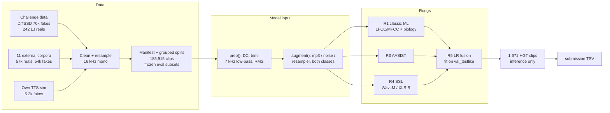

# HEARSAY — telling real speech from synthetic speech

HackGT 2026 · NSA "HEARSAY" challenge. Score each of 1,671 test clips from **0.0 (confident real)** to **1.0 (confident
synthetic)**. The metric is the organizers' ASVspoof 5 Track-1 **minDCF** (lower is better; 0 = perfect, 1 = trivial).

**Start here:** [`docs/00_development_log.md`](docs/00_development_log.md) (every stage, the rules fixed before results, and what happened) · **Architectures:** [`docs/06_architecture.md`](docs/06_architecture.md) · **All results:** [`reports/leaderboard.md`](reports/leaderboard.md)

## Where we are

**Official score on the HGT test set: minDCF 0.0584, EER 2.5 %** (organizers' scorer: Pspoof 0.3, Cfa 4, higher
score = real, so submissions are written flipped; see [`docs/01_challenge_and_scoring.md`](docs/01_challenge_and_scoring.md) §7). The submitted system
is **R5**: an XLS-R-300M model fine-tuned end to end, fused with a classic-feature + speech-biology model. Full story:
[`reports/05_r5_submission_and_official_score.md`](reports/05_r5_submission_and_official_score.md). How far it transfers to public benchmarks it never saw:
[`reports/06_generalization.md`](reports/06_generalization.md).

Our own headline = combined minDCF on `test_internal_testlike`: 9,747 held-out clips at the test's ~70/30 real/fake mix.
About half its fakes (1,434 of 2,924) come from three generators held out of training entirely. It is frozen, and
nothing is ever tuned on it. The table below is the ladder up to R1; the final rungs are in `reports/05_r5_submission_and_official_score.md`
(R4ft 0.0282, R5 0.0218).

| model | what it is | headline |
|---|---|---|
| R0 raw → after `prep()` | LightGBM on 9 trivial cues (duration, silence, level, bandwidth) | 0.542 → 0.921 |
| R1 | LightGBM on 228 spectral + speech-biology features, full train set | **0.253** |
| R5 (smoke) | LR fusion of R1's spectral-only and biology-only models ([`scripts/fuse.py`](scripts/fuse.py)) | 0.260 |
| **R4ft** | XLS-R-300M (12 blocks) fine-tuned end to end + light back end ([report](reports/04_r4ft_xlsr.md)) | **0.0282** |
| **R5 (submitted)** | LR fusion of R4ft + R1 | **0.0218** (optimistic; picked after seeing it) |

## The approach in one picture (planned pipeline; see the table above for what has run)



## What we learned (the short version)

1. **The given data has a trap.** On the given data alone, a depth-3 tree on trivial cues (bandwidth, silence, level)
   separated real from fake *perfectly*. One cue is the organizers' 242 real clips keeping energy up to 8 kHz, which
   properly resampled clips lack. `prep()` (DC removal, silence trim, 7 kHz low-pass, RMS normalization) plus 0–7 kHz
   features neutralize these cues: a trivial-cue LightGBM goes from 0.54 on raw audio to 0.92 (near chance) after
   `prep()`. See [`reports/01_data_audit.md`](reports/01_data_audit.md).
2. **One real speaker is not "real speech".** 242 clips of one voice against 70,000 diverse fakes teaches "LJ = real".
   We added 57k real clips from 10 corpora (including the LibriSpeech speakers DiffSSD clones) and LJ-voice fakes.
   See [`docs/03_external_data.md`](docs/03_external_data.md).
3. **Biology helps, modestly.** 48 physiology-motivated features (jitter, shimmer, HNR, formant dynamics, micro-prosody)
   are weak alone but add to spectral features. See [`docs/05_speech_biology.md`](docs/05_speech_biology.md).
4. **Unseen generators are the real test.** Errors concentrate on two of the three held-out generators (PlayHT,
   UnitSpeech; the third, DiffGAN-TTS, is easy) and on real corpora with unusual recording chains (ASVspoof 5 reals). See [`reports/03_error_analysis.md`](reports/03_error_analysis.md).
5. **The scorer disagrees with the brief** about which error costs 4×. We report both readings everywhere. See
   [`docs/01_challenge_and_scoring.md`](docs/01_challenge_and_scoring.md).

## Read more

| topic | document |
|---|---|
| Development log: every stage, pre-registered rules, deviations | [`docs/00_development_log.md`](docs/00_development_log.md) |
| Data: sources, cleaning, splits, frozen eval subsets | [`docs/02_dataset.md`](docs/02_dataset.md), [`reports/01_data_audit.md`](reports/01_data_audit.md) |
| External corpora survey (20 datasets, licenses) | [`docs/03_external_data.md`](docs/03_external_data.md) |
| How synthetic speech is made; our TTS sim; ElevenLabs | [`docs/04_synthetic_speech.md`](docs/04_synthetic_speech.md) |
| How real speech is made, and what synthesis gets wrong | [`docs/05_speech_biology.md`](docs/05_speech_biology.md) |
| The metric, both cost readings, default-value game theory | [`docs/01_challenge_and_scoring.md`](docs/01_challenge_and_scoring.md) |
| Classic ML results + feature importance | [`reports/02_r1_classic.md`](reports/02_r1_classic.md) |
| Model architectures (flowcharts R0 to E5) | [`docs/06_architecture.md`](docs/06_architecture.md) |
| Error analysis | [`reports/03_error_analysis.md`](reports/03_error_analysis.md) |
| Fine-tuned XLS-R (R4ft) | [`reports/04_r4ft_xlsr.md`](reports/04_r4ft_xlsr.md) |
| R5 submission and the official score | [`reports/05_r5_submission_and_official_score.md`](reports/05_r5_submission_and_official_score.md) |
| Public benchmarks and call-audio stress tests | [`reports/06_generalization.md`](reports/06_generalization.md) |
| R6 and the final submission (E5) | [`reports/07_r6_and_final_submission.md`](reports/07_r6_and_final_submission.md) |

## How the work was done

Two laptops, one repo. A CPU laptop (16 threads, 60 GB RAM) coordinated and owned the dataset and submission files, and
a GPU laptop (RTX 5050, 8 GB) trained the neural models. They exchanged messages and files over a small authenticated
service on the local network, and **every PR was reviewed by the other machine before merge**. Those reviews caught real
bugs: a submission writer that silently defaulted every row, leaky cross-validation folds, and a training weight derived
from the headline set.

## Reproduce

Windows PowerShell, from the repo root (Python 3.12):
```
py -3.12 -m venv .venv
.venv\Scripts\pip install -r requirements.txt   # pins CPU torch via the PyTorch index in the file
$env:HEARSAY_ROOT = (Get-Location).Path          # the code's default root is the author's laptop path (src/hearsay/audio.py)
$env:PYTHONPATH = "src"
```
GPU machines: install a CUDA torch build first (we used `torch 2.14.0+cu130` from https://download.pytorch.org/whl/cu130),
then install requirements.txt **without** its two torch lines, or pip swaps the CPU build back in.

Put the challenge data under `data/raw/` (`diffssd/`, `lj_real/`, `hgt_test/`) and the organizers' `asvspoof5` repo
under `third_party/`. Rebuild the dataset:
```
python scripts/clean_given.py                     # DiffSSD + LJ -> 16 kHz canonical clips + manifests
python scripts/ingest_ljspeech.py                 # and ingest_librispeech.py, ingest_wavefake.py, ingest_hf_sasb.py,
                                                  #     ingest_mlaad_tiny.py (docs/03_external_data.md, section 5)
python scripts/run_sim.py                         # own TTS sim
python scripts/make_splits.py                     # reads the committed splits/eval_subsets_frozen.csv
```
The models and the final submission (the order of `scripts/README.md`):
```
python scripts/extract_classic.py --workers 10 --n-fake 200000   # R1 features, every train row
python scripts/extract_classic.py --hgt --workers 10              # the 1,671 test clips (inference only)
python scripts/train_classic.py --suffix _full --no-svm           # R1 -> R1_lgbm_all_full
python scripts/finetune_ssl.py train --device cuda                # R4ft (XLS-R-300M, 12 blocks)
python scripts/finetune_ssl.py score --device cuda --hgt
python scripts/fuse.py --name R5_r4ft_r1 --models R4ft_xlsr_light R1_lgbm_all_full    # R5
python scripts/ingest_bench.py asvspoof2021_df asvspoof2021_df_b cd_add decro_en deepvoice
python scripts/bench_to_manifest.py asvspoof2021_df asvspoof2021_df_b cd_add decro_en && python scripts/make_splits.py
python scripts/finetune_ssl.py train --device cuda --name R6_xlsr_light --seed 1   # R6
python scripts/finetune_ssl.py score --device cuda --name R6_xlsr_light --hgt
python scripts/bench_score.py r4ft --name R6_xlsr_light --device cuda --sets deepvoice
python scripts/r6_select.py --write                              # pre-registered rule -> E5 final submission
python scripts/score.py validate submission/HearsayScoreKey4GeorgiaMellon_FINAL.tsv
python -m pytest -q tests
```

```
docs/                     background, numbered in reading order (00 = development log, 06 = architectures)
reports/                  results, numbered in the order they happened (01 data audit ... 07 final submission)
src/hearsay/              package: audio I/O, preprocessing, features, sim, models, metrics, evaluation
scripts/                  reproducible CLIs, indexed by stage in scripts/README.md
tests/                    unit tests (python -m pytest -q tests)
splits/                   the frozen evaluation subsets
data/, third_party/       gitignored (audio, features, scores, weights; organizers' scorer)
```

## Credits and licenses

- **Organizers' scorer and baselines:** [asvspoof-challenge/asvspoof5](https://github.com/asvspoof-challenge/asvspoof5)
  (evaluation package, Baseline-AASIST by Tak & Jung, NAVER + EURECOM, MIT). Imported in place from `third_party/`,
  never copied or modified.
- **Data:** DiffSSD (Purdue; CC BY-NC-ND 4.0), LJSpeech (public domain), LibriSpeech (CC BY 4.0), WaveFake,
  LibriSeVoc and In-the-Wild (CC BY-SA 4.0), ASVspoof 2019 LA / ASVspoof 5 (ODC-By 1.0), CVoiceFake (CC BY 4.0), DFADD
  (MIT), **SONAR and MLAAD-tiny (CC BY-NC 4.0)**. Per-clip licenses are in the manifest; details in
  [`docs/03_external_data.md`](docs/03_external_data.md). Because DiffSSD, SONAR and MLAAD-tiny are non-commercial, **models
  trained here are for non-commercial use only**. This repo redistributes no audio.
- **Pretrained models:** microsoft/wavlm-base-plus, facebook/wav2vec2-xls-r-300m, and for the sim
  kakao-enterprise/vits-ljs (MIT), facebook/mms-tts-eng (CC BY-NC 4.0), microsoft/speecht5_tts + speecht5_hifigan (MIT).
- **Code license:** none chosen yet (owner's decision); the repository is private.
