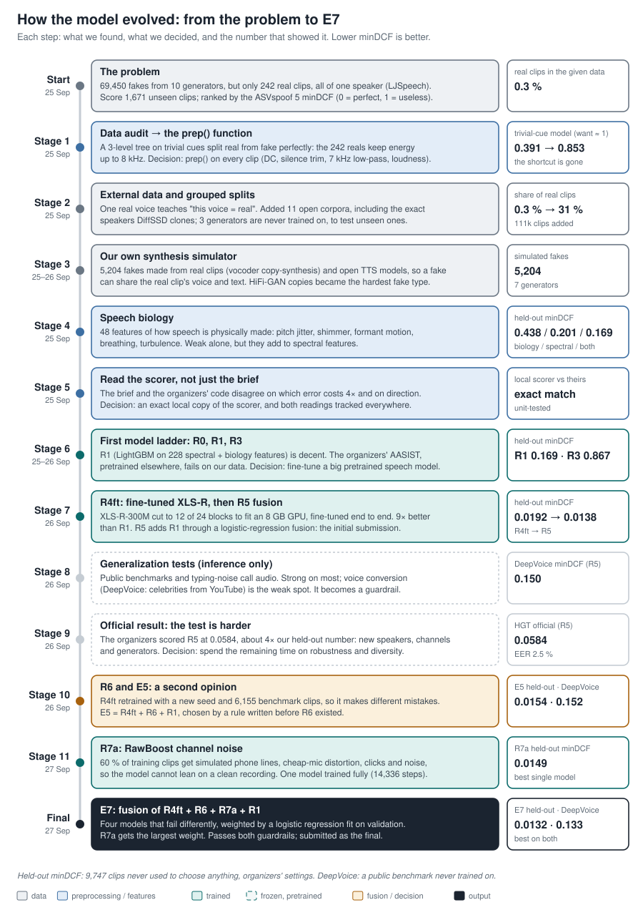
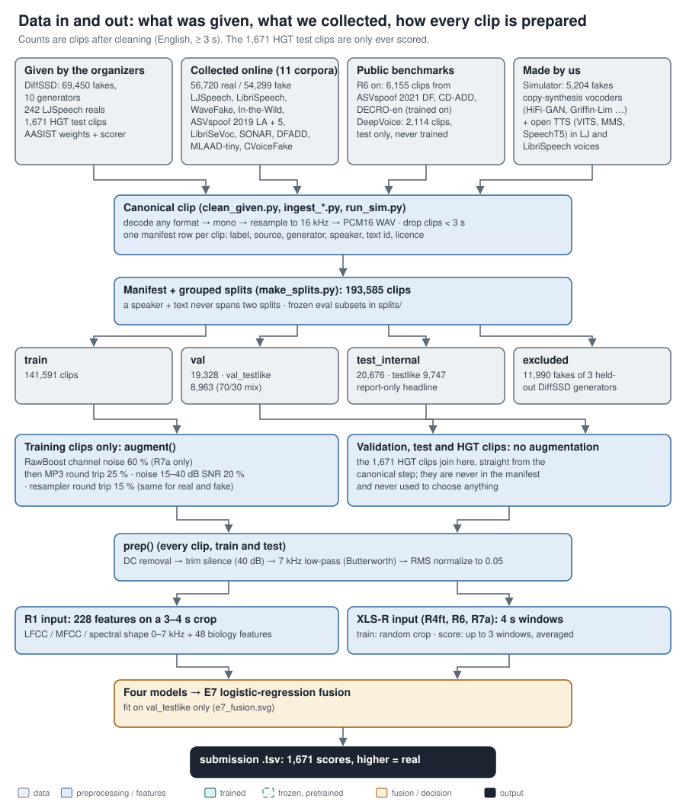
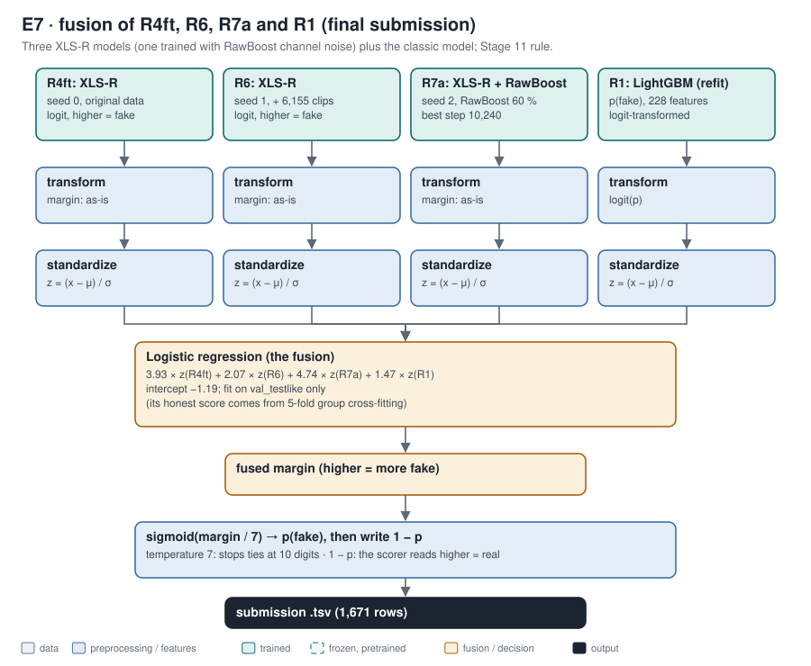

# HEARSAY: telling real speech from synthetic speech

HackGT 2026 · NSA "HEARSAY" challenge. Given 1,671 English test clips, score each one for how likely it is to be
real human speech or machine-generated (text-to-speech or voice cloning). The organizers rank teams by the ASVspoof 5
**minDCF**: a cost where missed fakes and false alarms are weighted, and 0 is perfect and 1 is no better than giving
every clip the same answer. Their scorer uses Pspoof 0.3, Cmiss 1, Cfa 4 and reads a **higher score as real**.

<p align="center">
  <a href="#how-the-model-evolved"></a>
  <a href="#data-what-went-in-and-how-every-clip-is-prepared"></a>
  <a href="#the-final-model-e7"></a>
  <br><sub><b>How the model evolved</b> · <b>Data in and out</b> · <b>The final model, E7</b> (click for each section)</sub>
</p>

## Results

| submission | system | HGT test (official) |
|---|---|---|
| initial | **R5**: fine-tuned XLS-R + classic features | **minDCF 0.0584, EER 2.5 %** |
| final | **E7**: three fine-tuned XLS-R models + classic features | pending (the organizers keep the better of the two) |

On our own held-out set (`test_internal_testlike`: 9,747 clips at the test's 70/30 real/fake mix, with half its fakes
from three generators never trained on; same scorer settings), each step up the ladder:

| model | what it is | minDCF | EER |
|---|---|---|---|
| R0 | LightGBM on 9 trivial cues (length, silence, level, bandwidth) after cleanup | 0.853 | 34.0 % |
| R3 | the organizers' pretrained AASIST, used as-is | 0.867 | 32.5 % |
| R1 | LightGBM on 228 spectral + speech-biology features | 0.169 | 6.6 % |
| R4ft | XLS-R-300M speech model, fine-tuned end to end | 0.0192 | 0.76 % |
| R6 | R4ft retrained: new seed, 6,155 more clips | 0.0236 | 0.89 % |
| R7a | R4ft retrained with RawBoost channel-noise augmentation | 0.0149 | 0.61 % |
| R5 | fusion of R4ft + R1 (initial submission) | 0.0138 | 0.54 % |
| E5 | fusion of R4ft + R6 + R1 | 0.0154 | 0.69 % |
| **E7** | **fusion of R4ft + R6 + R7a + R1 (final submission)** | **0.0132** | **0.54 %** |

The HGT test is harder than anything we could hold out (R5: 0.0138 here, 0.0584 official), because its speakers,
recording chains and generators differ from ours.

## How the model evolved


The major design decisions, in order:
1. **Clean the shortcut out first.** The given reals differed from the fakes in trivial ways (bandwidth, silence,
   level), so `prep()` normalizes every clip before any model sees it.
2. **Fix the data, not just the model.** One real voice against 70,000 fakes teaches the wrong thing, so we added
   11 open corpora and our own simulated fakes in the real voices, and held three generators out of training.
3. **Understand the signal.** Speech-biology and spectral features gave an interpretable baseline (R1) and exposed
   the shortcut.
4. **Use a pretrained speech model, fine-tuned.** XLS-R fine-tuned end to end beat every hand-made feature by 9×.
5. **Aim at the test's difficulty, not our validation set.** The official score was 4× our held-out number, so the
   last steps added diversity (R6: new data and seed) and channel robustness (R7a: RawBoost).
6. **Combine models that fail differently.** Each fusion (R5, E5, E7) was chosen by a rule written before the
   results existed; E7 is the final.

## Data: what went in, and how every clip is prepared


- **Given:** 69,450 DiffSSD fakes from 10 generators, but only 242 real clips, all of one speaker (LJSpeech).
  A model trained on that alone learns "this voice = real".
- **Collected online:** 11 open corpora, 56,720 real and 54,299 fake clips (233 h), chosen to add real speakers,
  microphones and codecs, and more generator families. Later, 6,155 clips from three public benchmarks.
- **Made by us:** 5,204 fakes from a small synthesis simulator (vocoder copy-synthesis and open TTS models),
  including the given real speaker's voice.
- **Splits:** 193,585 clips, grouped so a speaker saying a sentence never lands in two splits. Three DiffSSD
  generators are never trained on, so validation measures unseen generators.
- **Preparation:** every clip is resampled to 16 kHz mono; `prep()` then removes DC, trims silence, low-passes at
  7 kHz and normalizes loudness. Training clips are also augmented (codec, noise, resampling, and RawBoost for R7a)
  the same way for both classes.
- **The HGT test clips** are only ever scored. Nothing was fit on them or chosen from their results.

## The final model: E7


1. **Three XLS-R models** (R4ft, R6, R7a). XLS-R-300M is a speech network pretrained without labels on 436k hours in
   128 languages. We keep its first 12 of 24 transformer blocks, add a small attention-pooling head, and fine-tune
   the whole thing to output one "fake" score per 4-second window (up to 3 windows per clip, averaged). The three
   differ in random seed, training data and augmentation, so they make different mistakes.
2. **One classic model** (R1): LightGBM on 228 hand-made features, 180 spectral and 48 describing the physiology
   of speech (pitch jitter, formant motion, breathing).
3. **Fusion:** each score is standardized, and a logistic regression fit on the validation set learns how much to
   trust each model. R7a gets the largest weight.
4. **Output:** the fused score goes through a sigmoid and is written as `1 − p`, because the scorer reads higher as
   real.

Charts for every model (R0 to E7): [`docs/06_architecture.md`](docs/06_architecture.md).

## What we learned

1. **The given data has a shortcut.** A depth-3 tree on trivial cues separated the given real clips from the fakes
   perfectly, because the 242 real clips keep energy up to 8 kHz and the fakes do not. `prep()` and 0–7 kHz features
   remove it: the same cues drop to near chance (0.92 minDCF). [`reports/01_data_audit.md`](reports/01_data_audit.md)
2. **One real speaker is not "real speech".** External reals, including the exact LibriSpeech speakers DiffSSD
   clones, took reals from 0.3 % to 31 % of the data. [`docs/03_external_data.md`](docs/03_external_data.md)
3. **Pretrained speech models beat hand-made features by 9×.** Fine-tuning XLS-R fixed the two failure modes of the
   classic model: unseen generators and real speech from unusual recording chains.
   [`reports/03_error_analysis.md`](reports/03_error_analysis.md), [`reports/04_r4ft_xlsr.md`](reports/04_r4ft_xlsr.md)
4. **Channel robustness matters most for the test.** RawBoost (simulated phone lines, cheap microphones, clicks and
   background noise) made R7a the best single model on both validation and the held-out set, and it carries the
   most weight in E7.
   [`reports/08_r7_rawboost_and_final.md`](reports/08_r7_rawboost_and_final.md)
5. **The brief and the scorer disagree** on score direction and on which error costs 4×. Our first file followed the
   brief and scored 1.0; the flipped file scored 0.0584. [`docs/01_challenge_and_scoring.md`](docs/01_challenge_and_scoring.md)
6. **Voice conversion is the open weakness.** On the DeepVoice benchmark (celebrity voice conversion from YouTube,
   never trained on) the models rank well but miss many fakes at a fixed threshold.
   [`reports/06_generalization.md`](reports/06_generalization.md)

## How decisions were made

Every model choice followed a rule written in [`docs/00_development_log.md`](docs/00_development_log.md) before the
results it depends on existed: which checkpoint, which ensemble, and the guardrails it must pass. Choices use only the
validation set and the DeepVoice benchmark; the held-out set is scored once, after the choice. Where the plan changed
(an owner decision, a crashed run), the log records it as it happened.

## Documents

| topic | document |
|---|---|
| Development log: every stage, its rule, and what happened | [`docs/00_development_log.md`](docs/00_development_log.md) |
| The challenge, the metric, the scorer vs the brief | [`docs/01_challenge_and_scoring.md`](docs/01_challenge_and_scoring.md) |
| Cleaning, manifest and splits | [`docs/02_dataset.md`](docs/02_dataset.md) |
| External corpora (survey, licences, counts) | [`docs/03_external_data.md`](docs/03_external_data.md) |
| How synthetic speech is made; our simulator | [`docs/04_synthetic_speech.md`](docs/04_synthetic_speech.md) |
| How real speech is made; the biology features | [`docs/05_speech_biology.md`](docs/05_speech_biology.md) |
| Architecture charts, R0 to E7 | [`docs/06_architecture.md`](docs/06_architecture.md) |
| Data audit and the shortcut | [`reports/01_data_audit.md`](reports/01_data_audit.md) |
| Classic model (R1) | [`reports/02_r1_classic.md`](reports/02_r1_classic.md) |
| Error analysis | [`reports/03_error_analysis.md`](reports/03_error_analysis.md) |
| Fine-tuned XLS-R (R4ft) | [`reports/04_r4ft_xlsr.md`](reports/04_r4ft_xlsr.md) |
| Initial submission (R5) and its official score | [`reports/05_r5_submission_and_official_score.md`](reports/05_r5_submission_and_official_score.md) |
| Public benchmarks and call-audio stress tests | [`reports/06_generalization.md`](reports/06_generalization.md) |
| R6 and E5 | [`reports/07_r6_and_e5.md`](reports/07_r6_and_e5.md) |
| R7a and the final submission (E7) | [`reports/08_r7_rawboost_and_final.md`](reports/08_r7_rawboost_and_final.md) |
| Every scored model and set | [`reports/leaderboard.md`](reports/leaderboard.md) |

## Reproduce

Windows PowerShell, Python 3.12, from the repo root:
```
py -3.12 -m venv .venv
.venv\Scripts\pip install -r requirements.txt   # CPU torch; on a GPU machine install a CUDA torch build first
$env:HEARSAY_ROOT = (Get-Location).Path
$env:PYTHONPATH = "src"
```
Put the challenge data under `data/raw/` (`diffssd/`, `lj_real/`, `hgt_test/`) and the organizers'
[asvspoof5](https://github.com/asvspoof-challenge/asvspoof5) repo under `third_party/`. Then, in order:

```
# 1. data
python scripts/clean_given.py
python scripts/ingest_ljspeech.py          # also ingest_librispeech, ingest_wavefake, ingest_hf_sasb, ingest_mlaad_tiny
python scripts/run_sim.py
python scripts/ingest_bench.py asvspoof2021_df asvspoof2021_df_b cd_add decro_en deepvoice
python scripts/bench_to_manifest.py asvspoof2021_df asvspoof2021_df_b cd_add decro_en
python scripts/make_splits.py              # uses the committed splits/eval_subsets_frozen.csv

# 2. classic model (R1)
python scripts/extract_classic.py --workers 10 --n-fake 200000
python scripts/extract_classic.py --hgt --workers 10
python scripts/train_classic.py --suffix _full --no-svm

# 3. XLS-R models (GPU); each: train, then score validation/test/HGT, then the DeepVoice benchmark
python scripts/finetune_ssl.py train --device cuda                                            # R4ft
python scripts/finetune_ssl.py train --device cuda --name R6_xlsr_light --seed 1              # R6
python scripts/finetune_ssl.py train --device cuda --name R7a_xlsr_rb --seed 2 --rawboost 0.6 # R7a
python scripts/finetune_ssl.py score --device cuda --name <name> --hgt
python scripts/bench_score.py r4ft --name <name> --device cuda --sets deepvoice

# 4. fusion and the final file
python scripts/r7_select.py --write        # applies the Stage 11 rule -> submission/..._R7_FINAL.tsv
python scripts/score.py validate submission/HearsayScoreKey4GeorgiaMellon_R7_FINAL.tsv
python -m pytest -q tests
```

<details>
<summary>Every script, by stage</summary>

| stage | script | what it does |
|---|---|---|
| 1 data audit | `audit_raw.py` | decoding, duration, level, silence and band edges of the raw files |
| | `clean_given.py` | DiffSSD and the given reals → 16 kHz canonical clips + manifest |
| | `audit_shortcuts.py` | can a depth-3 tree on trivial cues separate real from fake? |
| | `check_manifest.py` | asserts the combined manifest is sound |
| 2 external data | `ingest_ljspeech.py`, `ingest_librispeech.py`, `ingest_wavefake.py`, `ingest_mlaad_tiny.py`, `ingest_hf_sasb.py` | one corpus (or HuggingFace repack family) each → canonical clips + manifest |
| | `ingest_common.py` | shared helpers for the ingest scripts |
| | `ingest_summary.py` | counts and checks for `docs/03_external_data.md` |
| | `make_splits.py` | unions all manifests, assigns grouped splits, applies the frozen eval subsets |
| 3 simulator | `run_sim.py`, `sim_figures.py` | the 5,204 simulated fakes, and figures comparing them with real speech |
| 4 biology | `extract_bio.py`, `bio_figures.py` | the 48 biology features, and their real-vs-fake effect sizes |
| 5 scoring | `score.py` | local copy of the organizers' minDCF; validates submission files |
| 6 first models | `extract_classic.py`, `train_classic.py` | R0/R1 features and models |
| | `run_aasist.py` | R3: the organizers' pretrained AASIST |
| | `extract_ssl.py`, `train_ssl_heads.py` | frozen speech-model embeddings with simple heads (R4) |
| 7 XLS-R + fusion | `vram_probe.py` | picks a memory configuration that fits the GPU |
| | `finetune_ssl.py` | trains and scores the fine-tuned XLS-R models (R4ft, R6, R7a) |
| | `plot_r4ft_curve.py` | training-curve figure |
| | `fuse.py` | logistic-regression fusion (R5) |
| | `make_submission.py` | writes a submission file (`--higher-is-real` for the scorer) |
| 8 generalization | `ingest_bench.py`, `make_keyguard_sets.py`, `bench_score.py` | public benchmarks and typing-noise sets, scored by frozen models |
| 10 R6 | `bench_to_manifest.py` | registers three benchmark sets as training data (never DeepVoice) |
| | `r6_select.py` | the Stage 10 rule → E5 |
| 11 R7 | `r7_select.py` | the Stage 11 rule → E7, the final submission |

</details>

## Repository layout

```
docs/          background, in reading order (00 development log ... 06 architecture); figures/ holds the charts
reports/       results, in the order they happened (01 data audit ... 08 final submission)
src/hearsay/   audio I/O, preprocessing, features, simulator, models, metrics, evaluation
scripts/       command-line steps (table above)
tests/         unit tests
splits/        the frozen evaluation subsets
data/, third_party/, submission/   not committed: audio, features, scores, weights, the organizers' code
```

Hardware: a CPU laptop (16 threads, 60 GB RAM) built the data and ran the classic models; a GPU laptop (RTX 5050,
8 GB) fine-tuned XLS-R in bf16 with gradient checkpointing.

## Credits and licences

- **Organizers' scorer and baseline:** [asvspoof-challenge/asvspoof5](https://github.com/asvspoof-challenge/asvspoof5)
  (evaluation package, Baseline-AASIST; MIT). Used in place from `third_party/`, not copied or modified.
- **Data:** DiffSSD (CC BY-NC-ND 4.0), LJSpeech (public domain), LibriSpeech (CC BY 4.0), WaveFake, LibriSeVoc and
  In-the-Wild (CC BY-SA 4.0), ASVspoof 2019 LA / ASVspoof 5 (ODC-By 1.0), CVoiceFake (CC BY 4.0), DFADD (MIT),
  SONAR and MLAAD-tiny (CC BY-NC 4.0); benchmarks per [`reports/06_generalization.md`](reports/06_generalization.md).
  Because some sources are non-commercial, **models trained here are for non-commercial use only**. No audio is
  redistributed.
- **Pretrained models:** facebook/wav2vec2-xls-r-300m, microsoft/wavlm-base-plus; for the simulator
  kakao-enterprise/vits-ljs (MIT), facebook/mms-tts-eng (CC BY-NC 4.0), microsoft/speecht5_tts + speecht5_hifigan (MIT).
- **Methods:** RawBoost (Tak et al., ICASSP 2022), AASIST (Jung et al., ICASSP 2022), XLS-R (Babu et al., 2021).
