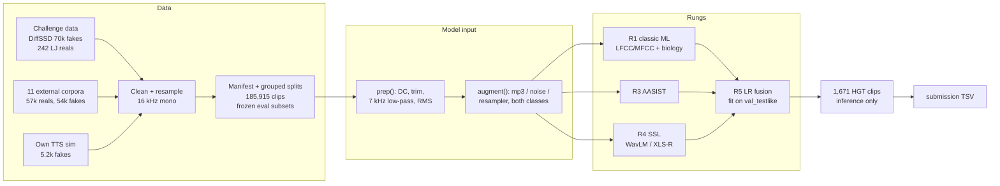

# HEARSAY — telling real speech from synthetic speech

HackGT 2026 · NSA "HEARSAY" challenge. Score each of 1,671 test clips from **0.0 (confident real)** to **1.0 (confident
synthetic)**. The metric is the organizers' ASVspoof 5 Track-1 **minDCF** (lower is better; 0 = perfect, 1 = trivial).

**Live status:** [`docs/STATUS.md`](docs/STATUS.md) · **All results:** [`reports/leaderboard.md`](reports/leaderboard.md)

## Where we are

Headline = combined minDCF on `test_internal_testlike`: 9,747 held-out clips at the test's ~70/30 real/fake mix, heavy
on generators never seen in training. It is frozen, and nothing is ever tuned on it.

| model | what it is | headline |
|---|---|---|
| R0 after `prep()` | trivial cues only (duration, silence, level, bandwidth) | 0.921: shortcut neutralized |
| R1 | LightGBM on 228 spectral + speech-biology features, full train set | **0.253** |
| R4ft (running) | XLS-R-300M fine-tuned end to end on GPU, AASIST-style back end ([plan](plans/08_ssl_aasist.md)) | — |
| R5 | fusion of the above ([`scripts/fuse.py`](scripts/fuse.py)) | — |

## The approach in one picture



## What we learned (the short version)

1. **The given data has a trap.** The organizers' 242 real clips keep energy up to 8 kHz; every properly resampled clip,
   real or fake, does not. A depth-3 tree on trivial cues separated the given data *perfectly*. We low-pass every clip
   at 7 kHz, and the cue drops to chance (R0: 0.92). See [`reports/data_audit.md`](reports/data_audit.md).
2. **One real speaker is not "real speech".** 242 clips of one voice against 70,000 diverse fakes teaches "LJ = real".
   We added 57k real clips from 11 corpora (including the LibriSpeech speakers DiffSSD clones) and LJ-voice fakes.
   See [`docs/external_data.md`](docs/external_data.md).
3. **Biology helps, modestly.** 48 physiology-motivated features (jitter, shimmer, HNR, formant dynamics, micro-prosody)
   are weak alone but add to spectral features. See [`docs/speech_biology.md`](docs/speech_biology.md).
4. **Unseen generators are the real test.** Errors concentrate on held-out generators (PlayHT, UnitSpeech) and on real
   corpora with unusual recording chains. See [`reports/error_analysis.md`](reports/error_analysis.md).
5. **The scorer disagrees with the brief** about which error costs 4×. We report both readings everywhere. See
   [`docs/scoring.md`](docs/scoring.md).

## Read more

| topic | document |
|---|---|
| Plans, written before each phase | [`plans/`](plans/00_master_plan.md) |
| Data: sources, cleaning, splits, frozen eval subsets | [`docs/dataset.md`](docs/dataset.md), [`reports/data_audit.md`](reports/data_audit.md) |
| External corpora survey (20 datasets, licenses) | [`docs/external_data.md`](docs/external_data.md) |
| How synthetic speech is made; our TTS sim; ElevenLabs | [`docs/synthetic_speech.md`](docs/synthetic_speech.md) |
| How real speech is made, and what synthesis gets wrong | [`docs/speech_biology.md`](docs/speech_biology.md) |
| The metric, both cost readings, default-value game theory | [`docs/scoring.md`](docs/scoring.md) |
| Classic ML results + feature importance | [`reports/r1_classic.md`](reports/r1_classic.md) |
| Two-machine setup (CPU coordinator + GPU worker) | [`plans/07_two_node_protocol.md`](plans/07_two_node_protocol.md) |

## How the work was done

Two laptops, one repo. A CPU laptop (16 threads, 60 GB RAM) coordinates, and a GPU laptop (RTX 5050, 8 GB) trains the
neural models. Each runs a Claude Code session. They talk through a small authenticated LAN hub
([`tools/hub.py`](tools/hub.py)): messages, artifacts with sha256 checks, heartbeats. The task board is GitHub Issues,
and **every PR is reviewed by the other machine before merge**. Those reviews caught real bugs: a submission writer that
silently defaulted every row, a listener that could die on a hub restart, leaky cross-validation folds, and a training
weight derived from the headline set.

## Reproduce

```
py -3.12 -m venv .venv && .venv\Scripts\pip install -r requirements.txt     # GPU: install a CUDA torch build first
set HEARSAY_ROOT=<this folder>
```
Put the challenge data under `data/raw/` (`diffssd/`, `lj_real/`, `hgt_test/`) and the organizers' `asvspoof5` repo
under `third_party/`. Then run `scripts/clean_given.py` → `scripts/ingest_*.py` → `scripts/run_sim.py` →
`scripts/make_splits.py` → a rung's `extract_*` / `train_*` script → `scripts/fuse.py` →
`scripts/make_submission.py`. Tests: `python -m pytest -q tests`.

```
plans/  docs/  reports/   written record (plans first, then docs and results)
src/hearsay/              package: audio I/O, preprocessing, features, sim, models, metrics, evaluation
scripts/                  reproducible CLIs
tools/                    two-node hub + client
data/, third_party/       gitignored (audio, features, scores, weights; organizers' scorer)
```
