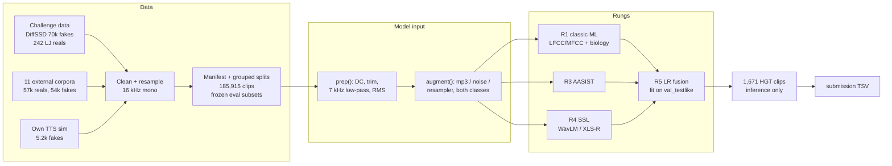

# HEARSAY — telling real speech from synthetic speech

HackGT 2026 · NSA "HEARSAY" challenge. Score each of 1,671 test clips from **0.0 (confident real)** to **1.0 (confident
synthetic)**. The metric is the organizers' ASVspoof 5 Track-1 **minDCF** (lower is better; 0 = perfect, 1 = trivial).

**Live status:** [`docs/STATUS.md`](docs/STATUS.md) · **All results:** [`reports/leaderboard.md`](reports/leaderboard.md)

## Where we are

Headline = combined minDCF on `test_internal_testlike`: 9,747 held-out clips at the test's ~70/30 real/fake mix. About
half its fakes (1,434 of 2,924) come from three generators held out of training entirely. It is frozen, and nothing is
ever tuned on it.

| model | what it is | headline |
|---|---|---|
| R0 raw → after `prep()` | LightGBM on 9 trivial cues (duration, silence, level, bandwidth) | 0.542 → 0.921 |
| R1 | LightGBM on 228 spectral + speech-biology features, full train set | **0.253** |
| R5 (smoke) | LR fusion of R1's spectral-only and biology-only models ([`scripts/fuse.py`](scripts/fuse.py)) | 0.260 |
| R4ft (planned, next on GPU) | XLS-R-300M fine-tuned end to end, AASIST-style back end ([plan](plans/08_ssl_aasist.md)) | — |

## The approach in one picture (planned pipeline; see the table above for what has run)



## What we learned (the short version)

1. **The given data has a trap.** On the given data alone, a depth-3 tree on trivial cues (bandwidth, silence, level)
   separated real from fake *perfectly*. One cue is the organizers' 242 real clips keeping energy up to 8 kHz, which
   properly resampled clips lack. `prep()` (DC removal, silence trim, 7 kHz low-pass, RMS normalization) plus 0–7 kHz
   features neutralize these cues: a trivial-cue LightGBM goes from 0.54 on raw audio to 0.92 (near chance) after
   `prep()`. See [`reports/data_audit.md`](reports/data_audit.md).
2. **One real speaker is not "real speech".** 242 clips of one voice against 70,000 diverse fakes teaches "LJ = real".
   We added 57k real clips from 10 corpora (including the LibriSpeech speakers DiffSSD clones) and LJ-voice fakes.
   See [`docs/external_data.md`](docs/external_data.md).
3. **Biology helps, modestly.** 48 physiology-motivated features (jitter, shimmer, HNR, formant dynamics, micro-prosody)
   are weak alone but add to spectral features. See [`docs/speech_biology.md`](docs/speech_biology.md).
4. **Unseen generators are the real test.** Errors concentrate on two of the three held-out generators (PlayHT,
   UnitSpeech; the third, DiffGAN-TTS, is easy) and on real corpora with unusual recording chains (ASVspoof 5 reals). See [`reports/error_analysis.md`](reports/error_analysis.md).
5. **The scorer disagrees with the brief** about which error costs 4×. We report both readings everywhere. See
   [`docs/scoring.md`](docs/scoring.md).

## Read more

| topic | document |
|---|---|
| Plans, written before each phase | [`plans/`](plans/00_master_plan.md) |
| Data: sources, cleaning, splits, frozen eval subsets | [`docs/dataset.md`](docs/dataset.md), [`reports/data_audit.md`](reports/data_audit.md) |
| External corpora survey (20 datasets, licenses) | [`docs/external_data.md`](docs/external_data.md) |
| How synthetic speech is made; our TTS sim; ElevenLabs | [`docs/synthetic_speech.md`](docs/synthetic_speech.md) |
| How real speech is made, and what synthesis gets wrong | [`docs/speech_biology.md`](docs/speech_biology.md) |
| The metric, both cost readings, default-value game theory | [`docs/scoring.md`](docs/scoring.md) |
| Classic ML results + feature importance | [`reports/r1_classic.md`](reports/r1_classic.md) |
| Two-machine setup (CPU coordinator + GPU worker) | [`plans/07_two_node_protocol.md`](plans/07_two_node_protocol.md) |

## How the work was done

Two laptops, one repo. A CPU laptop (16 threads, 60 GB RAM) coordinates, and a GPU laptop (RTX 5050, 8 GB) trains the
neural models. Each runs a Claude Code session. They talk through a small authenticated LAN hub
([`tools/hub.py`](tools/hub.py)): messages, artifacts with sha256 checks, heartbeats. The task board is GitHub Issues,
and **every PR is reviewed by the other machine before merge**. Those reviews caught real bugs: a submission writer that
silently defaulted every row, a listener that could die on a hub restart, leaky cross-validation folds, and a training
weight derived from the headline set.

## Reproduce

Windows PowerShell, from the repo root (Python 3.12):
```
py -3.12 -m venv .venv
.venv\Scripts\pip install -r requirements.txt   # pins CPU torch via the PyTorch index in the file
$env:HEARSAY_ROOT = (Get-Location).Path          # the code's default root is the author's laptop path (src/hearsay/audio.py)
$env:PYTHONPATH = "src"
```
GPU machines: install a CUDA torch build first (we used `torch 2.14.0+cu130` from https://download.pytorch.org/whl/cu130),
then install requirements.txt **without** its two torch lines, or pip swaps the CPU build back in.

Put the challenge data under `data/raw/` (`diffssd/`, `lj_real/`, `hgt_test/`) and the organizers' `asvspoof5` repo
under `third_party/`. Rebuild the dataset:
```
python scripts/clean_given.py                     # DiffSSD + LJ -> 16 kHz canonical clips + manifests
python scripts/ingest_ljspeech.py                 # and ingest_librispeech.py, ingest_wavefake.py, ingest_hf_sasb.py,
                                                  #     ingest_mlaad_tiny.py (docs/external_data.md, section 5)
python scripts/run_sim.py                         # own TTS sim
python scripts/make_splits.py                     # reads the committed splits/eval_subsets_frozen.csv
```
The current best (R1) and its submission:
```
python scripts/extract_classic.py --workers 10 --n-fake 200000   # spectral + biology features, every train row
python scripts/extract_classic.py --hgt --workers 10              # the 1,671 test clips (inference only)
python scripts/train_classic.py --suffix _full --no-svm           # -> R1_lgbm_all_full (+ __hgt scores)
python scripts/make_submission.py --model R1_lgbm_all_full --team <team>
python scripts/score.py validate submission/<team>_scores.tsv
python -m pytest -q tests
```

```
plans/  docs/  reports/   written record (plans first, then docs and results)
src/hearsay/              package: audio I/O, preprocessing, features, sim, models, metrics, evaluation
scripts/                  reproducible CLIs
tools/                    two-node hub + client
data/, third_party/       gitignored (audio, features, scores, weights; organizers' scorer)
```

## Credits and licenses

- **Organizers' scorer and baselines:** [asvspoof-challenge/asvspoof5](https://github.com/asvspoof-challenge/asvspoof5)
  (evaluation package, Baseline-AASIST by Tak & Jung, NAVER + EURECOM, MIT). Imported in place from `third_party/`,
  never copied or modified.
- **Data:** DiffSSD (Purdue; CC BY-NC-ND 4.0), LJSpeech (public domain), LibriSpeech (CC BY 4.0), WaveFake,
  LibriSeVoc and In-the-Wild (CC BY-SA 4.0), ASVspoof 2019 LA / ASVspoof 5 (ODC-By 1.0), CVoiceFake (CC BY 4.0), DFADD
  (MIT), **SONAR and MLAAD-tiny (CC BY-NC 4.0)**. Per-clip licenses are in the manifest; details in
  [`docs/external_data.md`](docs/external_data.md). Because DiffSSD, SONAR and MLAAD-tiny are non-commercial, **models
  trained here are for non-commercial use only**. This repo redistributes no audio.
- **Pretrained models:** microsoft/wavlm-base-plus, facebook/wav2vec2-xls-r-300m, and for the sim
  kakao-enterprise/vits-ljs (MIT), facebook/mms-tts-eng (CC BY-NC 4.0), microsoft/speecht5_tts + speecht5_hifigan (MIT).
- **Code license:** none chosen yet (owner's decision); the repository is private.
