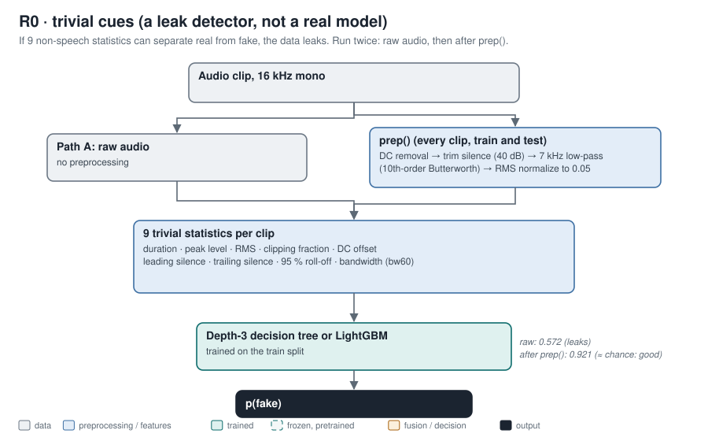
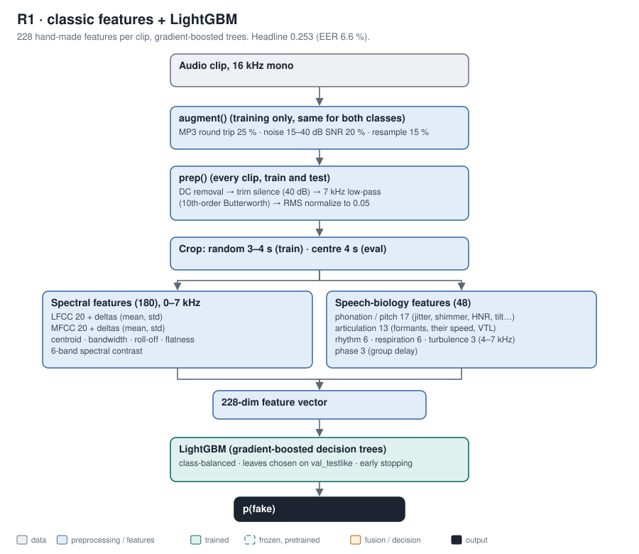
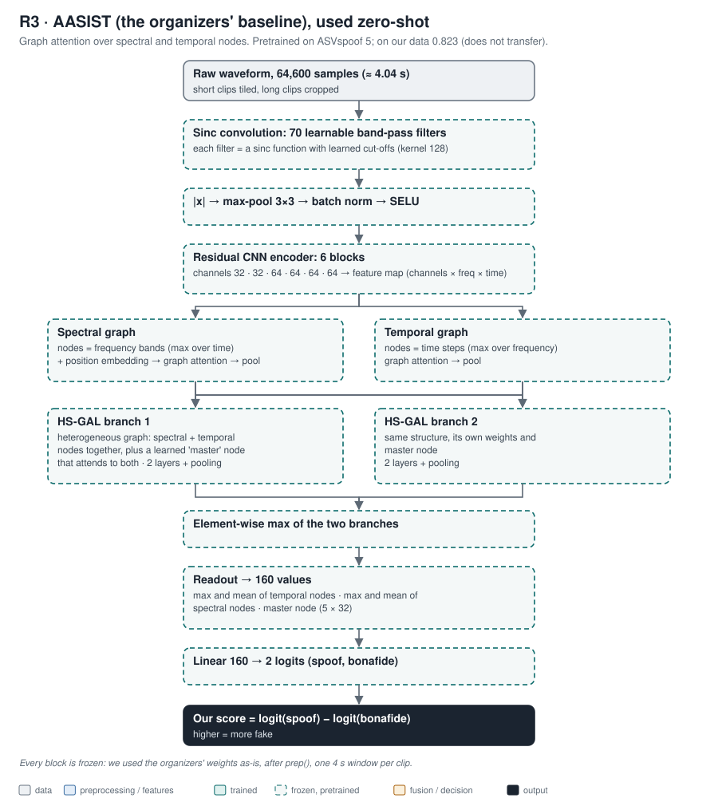
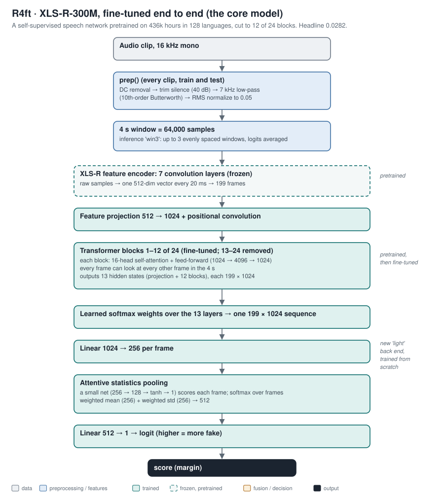
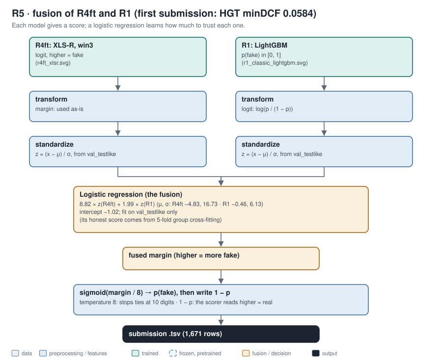
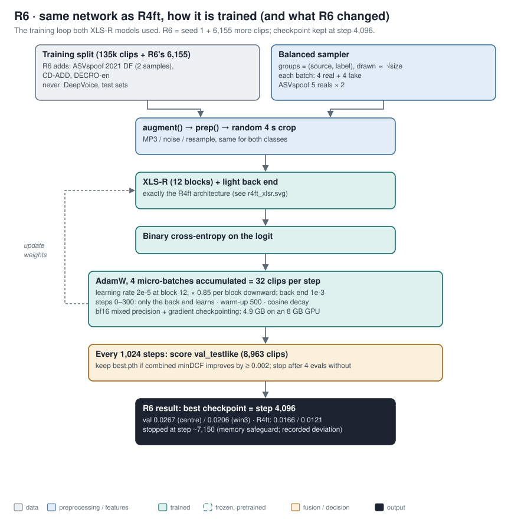
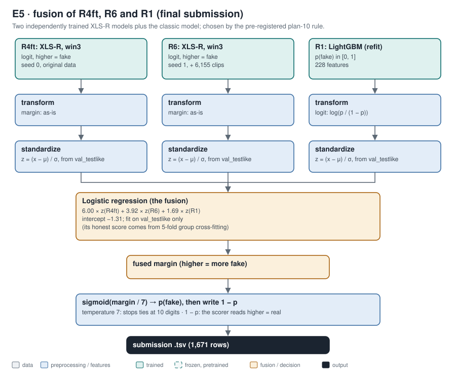

# Model architectures, rung by rung

One flowchart per model. The colours mean the same thing in every chart:

| colour | meaning |
|---|---|
| grey | data |
| blue | preprocessing and features |
| teal | parts that were trained |
| dashed | frozen pretrained parts |
| amber | fusion and decisions |
| dark | the output |

Regenerate the charts with `python docs/figures/architecture/make_architecture.py`.

## R0: trivial cues

R0 is a leak detector, not a real model. If nine non-speech statistics can separate real from fake, the classifier is
learning the recording pipeline:
- On raw audio they could: 0.572.
- After `prep()` they are near chance: 0.921. That is the result we want.

Source: `reports/data_audit.md`, `reports/r1_classic.md`.

## R1: classic features and LightGBM

Each clip becomes 228 numbers:
- 180 describe the spectrum (LFCC and MFCC, plus shape statistics, all below 7 kHz);
- 48 describe the physiology of speech (`docs/speech_biology.md`).

LightGBM then builds hundreds of small decision trees, each one correcting the mistakes of the trees before it.
Headline 0.253. Source: `reports/r1_classic.md`.

## R3: AASIST, the organizers' baseline

**What AASIST is** (Jung et al., 2022; the organizers' ASVspoof 5 weights). It reads the raw waveform, with no
spectrogram step:
1. **Sinc filterbank.** The first layer is a bank of 70 band-pass filters whose cut-off frequencies are learned.
   Each filter is a sinc function, so the network chooses which frequency bands to listen to.
2. **Residual CNN.** Six residual convolution blocks turn the filtered signal into a feature map: channels ×
   frequency × time.
3. **Two graphs.** The feature map is read as two graphs:
   - **spectral**: one node per frequency band;
   - **temporal**: one node per time step.

   Graph attention lets each node weigh its neighbours, so the model can relate, for example, a band at 4 kHz to a
   band at 2 kHz.
4. **HS-GAL.** Heterogeneous stacked graph attention combines both graphs into one heterogeneous graph with an extra
   learned "master" node that attends to everything. Two such branches run in parallel, and their element-wise
   maximum is kept.
5. **Readout.** Max and mean of each node type, plus the master node, give 160 numbers. A linear layer turns them
   into two logits (spoof, bonafide).

**How we used it:** zero-shot, after `prep()`. It scored 0.823 on our headline set: a strong model on its own data,
but it did not transfer to ours. Source: `src/hearsay/models/aasist_wrap.py`, `third_party/asvspoof5/Baseline-AASIST`.

## R4ft: XLS-R-300M, fine-tuned (the core model)

**What XLS-R-300M is.** A wav2vec 2.0 network from Meta with 300 M parameters. It was pretrained without labels on
436,000 hours of speech in 128 languages: it hides parts of the audio and learns to predict them. That teaches it
what real speech sounds like before it sees any fakes. Its three stages:
1. **Feature encoder.** A stack of 7 convolution layers turns raw audio into one 512-number vector every 20 ms. We
   keep it frozen.
2. **Transformer.** 24 transformer blocks; each lets every 20 ms frame attend to every other frame in the window. We
   keep only the first 12. Anti-spoofing cues live mostly in the lower and middle layers, and 12 blocks fit an 8 GB
   GPU.
3. **Our "light" back end** (trained from scratch):
   - a learned mix of the 13 layer outputs;
   - a projection to 256;
   - attentive statistics pooling (a small network weights each frame, then takes a weighted mean and standard
     deviation);
   - one output: a logit.

**Fine-tuning end to end** means the transformer's weights are updated too, with smaller learning rates in lower
layers (chart R6).

**Result:** 9× better than R1, headline 0.0282. Source: `reports/r4ft_xlsr.md`, `src/hearsay/models/ssl_e2e.py`.

## R5: fusion of R4ft and R1 (first submission, HGT minDCF 0.0584)

**Fusion** means combining models' scores instead of picking one. Each score is first put on a common scale:
1. **Transform.** R1's probability is turned into a logit, so both scores are unbounded "evidence" values.
2. **Standardize.** Each score gets zero mean and unit variance on the validation set.

A **logistic regression** then learns one weight per model: how much to trust each. It is fit only on validation, and
its honest validation number comes from 5-fold cross-fitting grouped by sentence.

**Writing the file:**
- The fused margin goes through a gentle sigmoid (temperature 8) so that no two scores tie.
- It is written as 1 − p, because the organizers' scorer reads a higher score as real.

Source: `scripts/fuse.py`, `data/scores/R5_r4ft_r1.json`.

## R6: the training loop (same network as R4ft)

R6 is the R4ft architecture trained again, with two changes:
- a different random seed;
- 6,155 more clips from three public corpora.

The chart shows the training loop both XLS-R models used. Training stopped early and kept the step-4,096 checkpoint;
the reason is recorded in `reports/r6_final.md`. On its own, R6 is weaker than R4ft on our validation set. Its value
is as a second, differently trained opinion.

## E5: fusion of R4ft, R6 and R1 (final submission)

E5 uses the same fusion recipe as R5, with a third input. The weights (6.00 / 3.92 / 1.69) show R6 carries real
weight: two XLS-R models trained on different data disagree on some clips, and averaging their evidence reduces each
model's individual mistakes.

E5 was chosen by the rule written before R6 existed (`plans/10_r6_final.md`): it was the only candidate that passed
both guardrails. Full spec: `data/models/e5/e5_fusion.json`. Source: `reports/r6_final.md`, `scripts/r6_select.py`.
