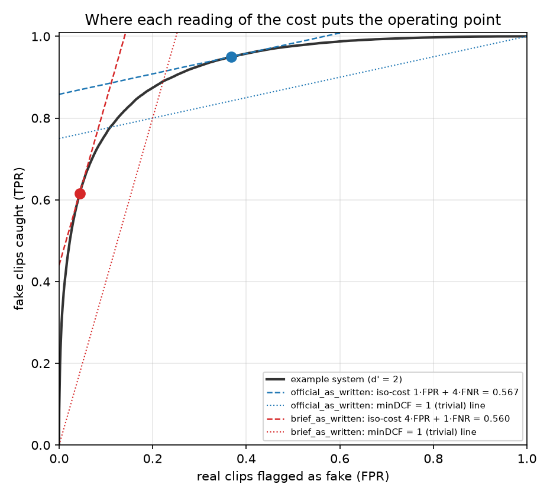
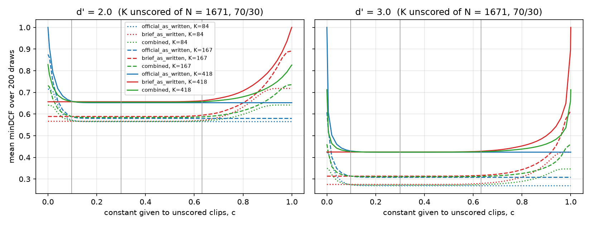

# Scoring: what minDCF rewards and how we play it

The HEARSAY leaderboard metric is **minDCF** from the ASVspoof5 Track-1 evaluation package, locally modified by the
organizers (`third_party/asvspoof5/evaluation-package`). This page records exactly what that code computes, where it
disagrees with the challenge brief, what operating point it rewards, and how to set the value of clips we cannot score.

Everything here is reproducible:

| What | Where |
|---|---|
| Local metric (bit-exact with the organizers' script) | `src/hearsay/metrics.py` |
| Equality tests vs. the organizers' `evaluation.py` | `tests/test_metrics.py` |
| CLI: metrics, submission validator, simulations/figures | `scripts/score.py` |

```bash
PYTHONPATH=src python -m pytest tests/test_metrics.py -q          # 8 tests, incl. subprocess calls to evaluation.py
PYTHONPATH=src python scripts/score.py metrics  scores.tsv key.tsv  # all metrics, both readings
PYTHONPATH=src python scripts/score.py validate submission.tsv      # before uploading
PYTHONPATH=src python scripts/score.py simulate                     # regenerates the figures and tables below
```

## 1. What the organizers' code computes

Source: `calculate_metrics.py::calculate_minDCF_EER_CLLR_actDCF` and `calculate_modules.py`.

| Item | Code | Value |
|---|---|---|
| Cost parameters | `Pspoof = 0.5` (original ASVspoof5: 0.05), `Cmiss = 1`, `Cfa = 4` (original: 10) | modified by organizers |
| Score direction | `bona_cm = cm_scores[key == 'bonafide']`, `compute_det_curve(bona, spoof)` | **higher = bonafide** |
| `frr(t)` ("miss") | fraction of *bonafide* scores below `t` | real clip rejected |
| `far(t)` ("false alarm") | fraction of *spoof* scores at or above `t` | fake clip accepted |
| Unnormalized cost | `Cmiss·frr·(1−Pspoof) + Cfa·far·Pspoof` = `0.5·frr + 2·far` | |
| Normalizer | `c_def = min(Cmiss·(1−Pspoof), Cfa·Pspoof)` = `min(0.5, 2)` = 0.5 | cost of the best trivial system |
| actDCF | threshold `−log(Cmiss(1−P)/(Cfa P))` = `log 4 ≈ 1.386` applied to the raw score as if it were an LLR | |

Dividing by `c_def`:

$$\text{minDCF} = \min_t \big[\, P_\text{miss}^\text{bona}(t) + 4\,P_\text{fa}^\text{spoof}(t) \,\big]$$

Consequences, each verified numerically (`scripts/score.py simulate` step 1 brute-forces the right-hand side over every
threshold on 20 random tied score sets and matches `min_dcf` to 1e-12; `tests/test_metrics.py` matches the
organizers' script to 1e-6 on its two bundled files and on four generated sets of 37 to 1,671 trials, including
heavy ties):

* **Bounded by 1.** Threshold below everything costs `0 + 4·1 = 4`; above everything costs `1 + 0 = 1`. So any
  constant submission scores exactly **1.0**, and 1.0 means "no better than doing nothing". The best is 0.0.
* **Rank-only.** Only the order of scores enters (`argsort`), so any strictly increasing transform leaves minDCF
  unchanged (tested with `s³`, `√s`, `0.2+0.5s`). Calibration does not matter for minDCF.
* **Prior-free.** Both terms are *per-class* rates. The test set's ~70/30 real/fake ratio does not appear in the
  formula; `Pspoof = 0.5` is a fixed weight, not the true prior. The effective spoof prior of the cost model is
  `Cfa·P / (Cfa·P + Cmiss·(1−P)) = 0.8`.
* **Ties are never split in your favor.** The scorer sorts with a stable mergesort after concatenating
  `[bonafide, spoof]`, so inside a tie group bonafide trials come first. Along a tie group the cost first rises
  (rejecting bonafide) and then falls (rejecting spoof), so its interior is never the minimum: minDCF equals the
  minimum over *proper* thresholds between distinct scores. (EER, by contrast, does look inside tie groups; our
  `eer()` copies that behaviour exactly.)
* **actDCF and CLLR are meaningless for this submission format.** They treat the raw score as a log-likelihood ratio.
  Our scores live in [0, 1], so under the organizers' direction every `1 − s ≤ 1 < log 4`: every clip is rejected and
  actDCF = **1.0** for *every* valid submission (the bundled example also prints 1.0). Only minDCF is ranked.

Worked example, the organizers' own `test_cm_file` (17 trials): minDCF 0.857143, EER 58.571 %, CLLR 0.975676,
actDCF 1.0, identical from `evaluation.py` and from `scripts/score.py metrics ... --higher-is-bonafide`.

## 2. The brief and the code disagree (twice)

| | Brief (`docs/challenge/HEARSAY_HackGT2026_Instructions.pdf`) | Scorer code |
|---|---|---|
| Direction | column 2 = 0.0 "100 % confident Real" … 1.0 "100 % confident synthetic" | higher = **bonafide** |
| 4× error | "penalty of 4 times greater for a false positive aka false alarm" where a false alarm is "identifying a real audio as fake" | `Cfa = 4` weights a **spoof accepted as bonafide**, i.e. a *missed fake* |

The direction mismatch must be resolved by the organizers somehow, because feeding our file unflipped would rank every
good system as perfectly inverted, which scores **1.0** (tested: `min_dcf(1 − y, y) == 1.0`). The two consistent
readings are:

| Name in `metrics.py` | How the organizers would get there | minDCF, in our words |
|---|---|---|
| `official_as_written` | feed `1 − score` into the unmodified script | `min_t [ P(real flagged) + 4·P(fake passed) ]` |
| `brief_as_written` | cost weights as the brief states: `Cmiss = 4, Cfa = 1` on `1 − score`. (The same number results from feeding raw scores with a key that treats *spoof* as the target class.) | `min_t [ 4·P(real flagged) + P(fake passed) ]` |
| `combined` | mean of the two | our model-selection metric until the organizers answer |

Both keep `c_def = 0.5`, so both are bounded by 1 and give 1.0 for a constant file. On the organizers' example they
differ a lot (0.857 vs 1.000), so the choice matters. We report both everywhere.

## 3. The operating point each reading rewards



On a ROC plot (x = real clips flagged as fake, y = fakes caught) the cost `w_r·FPR + w_f·(1 − TPR)` is constant along
straight lines of slope `w_r / w_f`. minDCF is the lowest such line that touches the ROC curve:

| Reading | Iso-cost slope | Optimum for the example system (d′ = 2) | Region that decides the score | Trivial line (minDCF = 1) |
|---|---|---|---|---|
| official_as_written | 1/4 | FPR 0.37, TPR 0.95, minDCF 0.567 | **high TPR**: catch almost every fake, tolerate false alarms | TPR = 0.75 + FPR/4 |
| brief_as_written | 4 | FPR 0.04, TPR 0.62, minDCF 0.560 | **low FPR**: almost never flag a real clip | TPR = 4·FPR |

Because minDCF is rank-only, **one submission is scored at both points at once**; the reading only changes which part
of the ROC our modelling effort should improve. The equal-weight `combined` metric asks for a ROC that is good at both
ends.

What one clip is worth on the test set (1,671 clips, ~1,170 real / ~501 fake):

| Reading | One real clip flagged as fake | One fake clip passed as real |
|---|---|---|
| official_as_written | +0.00085 | **+0.0080** |
| brief_as_written | **+0.0034** | +0.0020 |

Under the official reading our stopping target of minDCF ≤ 0.05 allows, for example, 3 missed fakes plus 30 flagged
reals; under the brief reading, 5 missed fakes plus 11 flagged reals.

## 4. Default-value game theory

The brief asks what score to give clips we cannot score ("This could be crucial!"). The template fills every row with
0.006.

**Setup.** K of N clips get one constant `c`; they form one tie group. From Section 1, a tie group is never split: at
any threshold the whole block is either flagged or passed. If the block has `K_r` reals and `K_f` fakes, flagging it
adds `w_r·K_r/N_r` to the cost and passing it adds `w_f·K_f/N_f`. With a representative 70/30 block both reals and
fakes are a fraction `k = K/N` of their class, so:

| Reading | Block flagged | Block passed | Cheap choice |
|---|---|---|---|
| official_as_written | `k` | `4k` | flag it: `c` must rank **above** the official threshold |
| brief_as_written | `4k` | `k` | pass it: `c` must rank **below** the brief threshold |

The official optimum flags more clips than the brief optimum, so its threshold is lower (`C_brief − C_official =
3·(FPR − FNR)` decreases with the threshold). A constant placed **between the two thresholds** is therefore on the
cheap side under both readings at the same time. The combined metric is only optimal there; either extreme loses
`3k` under one of the readings.

**Where the gap is, in closed form.** With a calibrated posterior `p = P(fake | x)` at the test prior 0.3, the Bayes
decision rule flags when the likelihood ratio exceeds `Cmiss(1−P)/(Cfa·P)`: 1/4 (official) or 4 (brief). As
posteriors these are `p > 0.097` and `p > 0.632`. A clip we know nothing about has likelihood ratio 1, i.e.
`p = 0.3`, the prior. Since 1/4 < 1 < 4, **the "no evidence" score falls in the gap under both readings.**

**Simulation** (`scripts/score.py simulate`; equal-variance Gaussian system with separation d′, scores are exact
posteriors at prior 0.3, N = 1,671 at 70/30, K random clips replaced by `c`, 200 draws per point):



| d′ | K (share) | no defaults | c = 0.006 (template) | c = 0.097 | **c = 0.3 (prior)** | c = 0.632 | c = 1.0 |
|---|---|---|---|---|---|---|---|
| 2 | 84 (5 %) | 0.543 / 0.544 | 0.715 / 0.567 | 0.572 / 0.567 | **0.565 / 0.567** | 0.565 / 0.571 | 0.565 / 0.718 |
| 2 | 167 (10 %) | 0.534 / 0.545 | 0.860 / 0.589 | 0.588 / 0.589 | **0.580 / 0.589** | 0.580 / 0.594 | 0.580 / 0.891 |
| 2 | 418 (25 %) | 0.542 / 0.544 | 0.906 / 0.657 | 0.659 / 0.657 | **0.652 / 0.657** | 0.652 / 0.661 | 0.652 / 1.000 |
| 3 | 84 (5 %) | 0.230 / 0.236 | 0.421 / 0.275 | 0.274 / 0.275 | **0.269 / 0.275** | 0.269 / 0.280 | 0.269 / 0.424 |
| 3 | 167 (10 %) | 0.232 / 0.237 | 0.525 / 0.313 | 0.314 / 0.313 | **0.308 / 0.313** | 0.308 / 0.317 | 0.308 / 0.613 |
| 3 | 418 (25 %) | 0.233 / 0.235 | 0.607 / 0.425 | 0.430 / 0.425 | **0.424 / 0.425** | 0.424 / 0.428 | 0.424 / 1.000 |

Cells are `official / brief` mean minDCF. The "no defaults" column is the same draws before any clip is blanked.

Findings:

1. **Trivial all-constant submission = 1.0** under both readings (any constant, including the untouched template).
2. There is a wide flat optimum between the two Bayes thresholds, and `c = 0.3` ties for the best of the listed
   values in every row, under both readings.
3. Well placed, the blanked share behaves like a trivial system on its own fraction:
   `minDCF ≈ D + k·(1 − D)`, where D is the no-defaults score (d′ = 2, k = 0.25: 0.542 + 0.25·0.458 = 0.657,
   simulated 0.652 / 0.657).
4. The template value **0.006 is the worst reasonable choice under the official reading**: it passes the blanked fakes
   (+0.36 at d′ = 2, K = 418). `c = 1.0` is the mirror-image mistake under the brief reading (up to 1.0).

**Recommendation.**

* Score every clip with *some* model; any informative score beats a constant, whose share costs `k·(1 − D)`.
* If a clip truly cannot be scored, give it the score our submitted model assigns to "no evidence". With a posterior
  calibrated to the 70/30 test prior (calibration fitted on validation data only, never on HGT test audio), that is
  **c = 0.3**. With uncalibrated scores, use any value that ranks between the official and brief optimal thresholds
  **measured on validation**. Never leave 0.006 in place.
* Run `scripts/score.py validate` on the final file. It flags any rows still at 0.006.

## 5. Submission format checks (`scripts/score.py validate`)

Errors (non-zero exit): UTF-8 BOM, header ≠ `filename<TAB>cm-score`, a row that is not exactly two TAB-separated
fields, filenames that differ from the template in content, **order or count** (the brief says not to remove rows; the
scorer asserts the score and key filename sets are equal), non-numeric, NaN/inf or out-of-[0, 1] scores.
Warnings: CRLF line endings, rows still at 0.006, fewer than 3 distinct values (the minDCF of a constant file is 1.0).

## 6. Questions for the organizers (Discord, #hearsay)

1. Is our score passed to `evaluation.py` as `1 − score` (so that "1.0 = synthetic" becomes the ASVspoof
   "higher = bonafide")? If it is passed unflipped, every good system scores ≈ 1.0.
2. Which error costs 4×: a **real clip flagged as fake** (brief text) or a **fake accepted as real** (`Cfa = 4` in the
   modified `calculate_metrics.py`)?
3. Is the ranked number the `min DCF` printed by the provided `calculate_metrics.py` with `Pspoof = 0.5, Cmiss = 1,
   Cfa = 4`, unchanged at evaluation time?
4. Is actDCF used at all? For any [0, 1] score file it is identically 1.0 with this code.
5. Are rows with duplicate or missing filenames rejected, or scored after a join?
6. Is the scored set exactly the 1,671 template rows, or is a hidden subset used?

## References

* ASVspoof5 evaluation package: <https://github.com/asvspoof-challenge/asvspoof5> (the local copy has the organizers'
  modified costs).
* X. Wang et al., "ASVspoof 5: Design, collection and validation of resources for spoofing, deepfake, and adversarial
  attack detection using crowdsourced speech", <https://arxiv.org/abs/2502.08857>. Defines the normalized minDCF used here.
* N. Brümmer and J. du Preez, "Application-independent evaluation of speaker detection", *Computer Speech &
  Language* 20 (2006). Background on DCF normalization, Bayes thresholds and CLLR.
