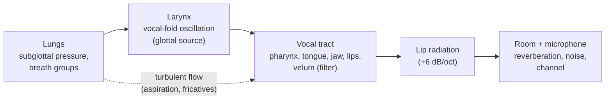
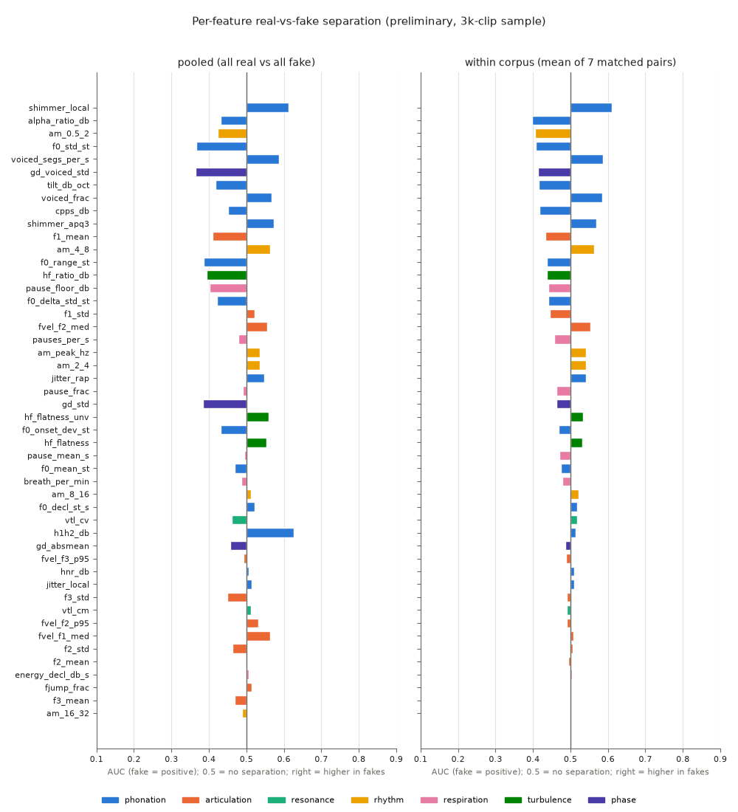
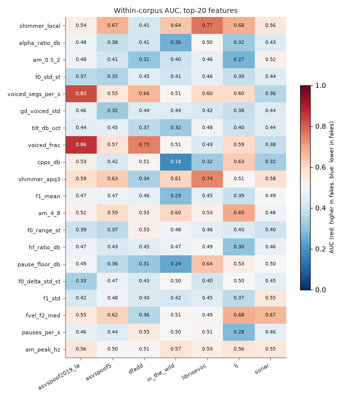
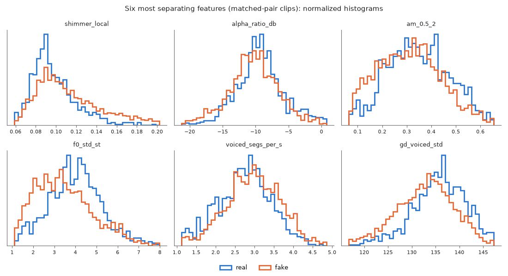

# The biology of real speech, and where synthesizers slip

A person talking is a pump, a vibrating valve, a moving tube and a room. Each stage leaves marks in the waveform that
come from anatomy and physics. A text-to-speech (TTS) or voice-cloning system learns only to match the *output
statistics* of those marks. This document goes through the production chain one stage at a time and asks the same
three questions at each stage:

1. **Physiology.** What does the body actually do?
2. **Measurable correlate.** Which number in the audio reflects it, and where does
   [`src/hearsay/features/bio.py`](../src/hearsay/features/bio.py) compute it (feature names in `code`)?
3. **Synthesis hypothesis.** How could a neural TTS or vocoder get it wrong, and in which direction?

The last section tests those hypotheses on a 3,000-clip sample. The findings are **preliminary**. They also show that
several "biological" cues are really cues about which recording pipeline a clip came from. That is the most useful
result here, and it matters for Phase 6.



---

## 1. Respiration: the power supply

**Physiology.** Speech is produced on the exhalation. The speaker breathes in quickly and then lets the air out
slowly over a *breath group*, a stretch of speech between two inhalations. Lieberman (1967) made the breath group the
basic unit of intonation. Subglottal pressure falls as the lungs empty, so loudness and F0 drift downward over the
breath group ("declination"). At the next phrase boundary the speaker has to stop and inhale, and that inhalation is
often audible as broadband, unvoiced, low-level noise.

**Measurable correlates.**

| Feature | Definition |
|---|---|
| `pause_frac`, `pauses_per_s`, `pause_mean_s` | Internal pauses (≥150 ms, energy more than 35 dB below the 99th-percentile frame). Leading and trailing silence are excluded on purpose because they are editing artefacts. |
| `breath_per_min` | Unvoiced stretches ≥200 ms whose median energy is more than 10 dB above the clip's noise floor but more than 20 dB below speech peaks. This is a heuristic breath detector. |
| `pause_floor_db` | 10th-percentile pause energy relative to the speech peak. It separates digital silence from room noise or breath. |
| `energy_decl_db_s`, `f0_decl_st_s` | Linear slope of frame energy (dB/s) and of F0 (semitones/s) over the utterance. |

**Synthesis hypothesis.** TTS acoustic models learn pauses from punctuation. Breaths are either absent, because
training data is often breath-trimmed, or copied in as a learned token. Pauses can be too short, too regular or
missing inside sentences. Silence can be *digital* (no noise floor) because nothing is recorded between words.
Layton et al. (2024) showed that a simple breath detector alone separates news-style deepfakes from real speech. That
is the strongest published evidence for this stage.

## 2. Phonation: the vibrating valve

**Physiology.** Under the **myoelastic-aerodynamic theory** (van den Berg, 1958), the vocal folds do not oscillate
because nerves fire at F0. They are a self-oscillating valve. Subglottal pressure pushes them apart; their elastic
recoil and the Bernoulli pressure drop in the fast glottal jet pull them back together. The muscles (cricothyroid,
thyroarytenoid) set tension and adduction, and the aerodynamics produce the cycle (Titze, 1994). Each cycle releases
a **glottal flow pulse**: a slow opening, a faster closing, then a closed phase. The sharp closure is the main
excitation of the vocal tract. The pulse spectrum falls at about −12 dB/octave (Fant, 1960). Because tissue is
biological and the airflow is slightly turbulent, successive cycles are *never identical*. They show small, partly
random period perturbation (**jitter**) and amplitude perturbation (**shimmer**), plus aspiration noise mixed into the
harmonics. Breathier voices, with incomplete closure, have a stronger first harmonic relative to the second
(**H1–H2**) and a steeper spectral tilt (Klatt & Klatt, 1990).

**Measurable correlates.** All are computed with Praat through Parselmouth (Boersma & Weenink; Jadoul et al., 2018)
where Praat has a standard algorithm:

| Feature | Definition | Typical healthy value |
|---|---|---|
| `f0_mean_st`, `f0_std_st`, `f0_range_st` | F0 from Praat's autocorrelation tracker (60–500 Hz), in semitones re 100 Hz (5–95 % range) | male ≈ 100–120 Hz, female ≈ 200 Hz |
| `jitter_local`, `jitter_rap` | Mean absolute difference of consecutive periods / mean period; RAP uses a 3-period moving average | Praat's pathology threshold for local jitter is 1.04 % |
| `shimmer_local`, `shimmer_apq3` | The same idea applied to peak amplitudes | Praat threshold for local shimmer 3.81 % |
| `hnr_db` | Harmonics-to-noise ratio (cross-correlation method; Boersma, 1993) | ~20 dB for sustained vowels, lower in running speech |
| `cpps_db` | Smoothed cepstral peak prominence (Hillenbrand et al., 1994; Hillenbrand & Houde, 1996): height of the cepstral peak at the pitch quefrency above a regression baseline. It measures how periodic the voice is without needing exact period marks. Our NumPy version is ~10× faster than Praat's and correct in *ordering*, but it is not on Praat's absolute scale. | n/a |
| `h1h2_db` | Level of the harmonic nearest F0 minus the one nearest 2·F0 (not formant-corrected) | breathy > modal > pressed |
| `tilt_db_oct`, `alpha_ratio_db` | Slope of the long-term spectrum from 100 to 5000 Hz (dB/oct); energy ratio 1–5 kHz vs 0–1 kHz | about −6 dB/oct for modal voice after lip radiation |

**Synthesis hypothesis.** Neural vocoders (HiFi-GAN, WaveGrad, diffusion vocoders) generate the waveform from a mel
spectrogram. A mel frame (~11–12 ms hop) cannot represent individual glottal cycles, so the vocoder has to *invent*
cycle-level detail. Two failure modes are possible. (a) The output is **too regular**: lower jitter and shimmer,
higher HNR and CPPS, because averaging during training removes the random component. (b) The perturbation is
**unphysiological**: noise with the wrong temporal correlation, visible as a mismatch between `jitter_local`
(cycle-to-cycle) and `jitter_rap` (smoothed). F0 contours predicted by a prosody model also tend to regress to the
mean, which reduces `f0_std_st` and `f0_range_st`. Chaiwongyen et al. (2022, APSIPA) used shimmer features in the same
way for deepfake detection.

## 3. Source-filter theory: why the two can be separated

**Physiology/physics.** Fant (1960) modelled speech as a **source** (glottal pulses or turbulence noise) passed
through a linear **filter** (the vocal tract's resonances, the *formants*) and a radiation term. To a first
approximation the two are independent. The larynx sets F0 and voice quality, and the tract shape sets the vowel. This
independence is why the features above (source) and below (filter) can be measured separately. Stevens (1998) gives
the full acoustic treatment.

**Synthesis hypothesis.** Modern end-to-end TTS does *not* factor speech this way. It predicts a mel spectrogram in
which source and filter are entangled. Physically coupled quantities, such as HNR and spectral tilt, or F0 and H1–H2,
can therefore drift apart in combinations that no human larynx produces. A single feature may look normal while their
*joint* distribution does not. That is the argument for feeding these features to a multivariate model (Phase 6)
rather than thresholding each one.

## 4. Articulation and coarticulation: a moving tube with inertia

**Physiology.** The tongue, jaw, lips and velum are muscle-driven masses. They cannot jump. The tongue body moves
between vowel targets over tens of milliseconds, and neighbouring sounds overlap in time (**coarticulation**). Öhman
(1966) described VCV sequences as a continuous vowel-to-vowel gesture with the consonant gesture superimposed on it.
Formant frequencies therefore follow *smooth* trajectories with bounded velocity, and formant transitions into and
out of consonants carry place-of-articulation information.

**Measurable correlates.** Formants come from Praat's Burg LPC with a 5000 Hz ceiling when median F0 is below 160 Hz
and 5500 Hz otherwise (Praat's male/female convention). They are read only on voiced frames, every 10 ms.

| Feature | Definition |
|---|---|
| `f1_mean` … `f3_mean`, `f1_std` … `f3_std` | Formant level and spread |
| `fvel_f1_med`, `fvel_f2_med`, `fvel_f2_p95`, `fvel_f3_p95` | Formant velocity in Hz/s between consecutive voiced frames (median and 95th percentile) |
| `fjump_frac` | Fraction of voiced frame pairs in which any of F1–F3 moves by more than 400 Hz in 10 ms. That is faster than articulators move, so it flags a tracking jump or a splice. |

**Synthesis hypothesis.** An acoustic model that predicts frames with a smoothed (L1/L2 or diffusion) objective tends
to *over-smooth* trajectories. Formant spread and velocities then come out lower than natural. Concatenative
artefacts and attention glitches go the other way and produce implausible jumps. Blue et al. (2022) reconstructed
vocal-tract cross-sections from audio and found that deepfakes often imply anatomically impossible configurations.
The caveat is that LPC formant tracking is noisy on running speech, so velocity features partly measure tracker
instability. They are useful in aggregate, not as physical ground truth per frame.

## 5. Resonance and vocal-tract length: one body, one tube

**Physiology.** A uniform tube closed at the glottis and open at the lips resonates at
F<sub>n</sub> = (2n−1)·c / 4L. An adult male tract is about 17 cm long and an adult female tract about 14–15 cm. The
*spacing* of the formants (the formant dispersion, ΔF) therefore depends on vocal-tract length (VTL) and hardly at all
on which vowel is being said (Fitch, 1997). A speaker's VTL cannot change within a sentence. Lip rounding and larynx
lowering change it by only about a centimetre.

**Measurable correlate.** For each voiced frame we fit ΔF by least squares through the origin over F1–F4 against
(2n−1)/2 (the regression method of Reby & McComb, 2003). Then VTL = c / 2ΔF with c = 35,000 cm/s. `vtl_cm` is the
median and `vtl_cv` the coefficient of variation across frames.

**Synthesis hypothesis.** A cloned voice is a statistical average over reference audio. Nothing forces it to stay
consistent with one physical tube, so VTL could wander (higher `vtl_cv`) or sit at a value that does not match the F0
and voice quality it claims. Multi-speaker models that interpolate between speakers are the most likely to show this.

## 6. Neuromotor timing and micro-prosody

**Physiology.** Speech rhythm comes from motor control. Syllables arrive at about 4–5 per second. Across nine
languages, the amplitude-modulation spectrum of speech peaks at around 4–5 Hz, clearly separated from music at about
2 Hz (Ding et al., 2017). On a finer time scale, consonants perturb F0 at voicing onset in an involuntary way. F0 is
raised after voiceless obstruents and lowered after voiced ones for up to about 100 ms, because of laryngeal tension
and aerodynamic effects (Hombert, Ohala & Ewan, 1979). These **micro-prosodic** perturbations are side effects of
physiology, not something the speaker plans.

**Measurable correlates.**

| Feature | Definition |
|---|---|
| `am_0.5_2`, `am_2_4`, `am_4_8`, `am_8_16`, `am_16_32` | Share of energy-envelope modulation power (10 ms envelope, Hann-windowed FFT) in each band |
| `am_peak_hz` | Peak modulation frequency between 2 and 10 Hz (≈ syllable rate) |
| `f0_onset_dev_st` | Mean absolute F0 change over the first 40 ms of each voiced run: micro-prosody at voicing onset |
| `f0_delta_std_st` | Standard deviation of frame-to-frame F0 change within voiced runs: smoothness of the laryngeal control loop |
| `voiced_frac`, `voiced_segs_per_s` | Voicing duty cycle and rate of voiced segments |

**Synthesis hypothesis.** Duration models produce plausible but *too even* timing, which concentrates modulation in
a narrower band. F0 predicted at the frame or phone level from text has no physiological reason to contain
consonant-induced onset perturbations. It shows them only as far as the model memorised them, so `f0_onset_dev_st`
should be smaller in fakes. Very fine structure (`am_16_32`) depends on how sharp the onsets are, and vocoders may
blur or exaggerate it.

## 7. Turbulence: noise that the airflow makes

**Physiology.** When air is forced through a narrow constriction (the teeth for /s/, the lips for /f/, the glottis for
/h/ and aspiration), the jet becomes turbulent and produces broadband noise. The noise source sits in front of the
constriction, so its spectrum is shaped by the short front cavity, which puts most of the energy between 4 and 8 kHz
for sibilants (Stevens, 1998). The noise is truly random: its spectrum is *flat-ish* within the band, and it
fluctuates from frame to frame.

**Measurable correlates.** `hf_flatness` is spectral flatness (geometric mean / arithmetic mean of power) in the
**4–7 kHz** band, averaged over speech frames. `hf_flatness_unv` is the same over unvoiced speech frames (mostly
fricatives), and `hf_ratio_db` is the energy in 4–7 kHz relative to 0.05–4 kHz. The band stops at 7 kHz on purpose;
see [§11](#11-preliminary-evidence).

**Synthesis hypothesis.** A GAN or diffusion vocoder has to generate noise from a mel spectrogram whose top bands are
coarse. The result tends to be either **over-smooth and tonal**, with harmonic leakage into fricatives and low
flatness, or **too uniformly noisy** in the high band, with flatness too high and too constant.

## 8. Lip radiation and phase

**Physiology/physics.** Sound radiating from the mouth opening acts as a first-order high-pass, about +6 dB/octave
(Flanagan, 1972). Combined with the −12 dB/oct glottal source, this gives the familiar ≈ −6 dB/oct speech spectrum. The
whole chain (glottal pulse, then a minimum-phase-like vocal-tract all-pole filter, then radiation) is a physical
causal system. Its **phase** response is therefore structured and tied to the magnitude response: energy is
concentrated at glottal closure instants, and group delay peaks near formants (Yegnanarayana & Murthy, 1992).

**Measurable correlates.** Group delay τ(ω) = Re(X<sub>n</sub>·X*) / |X|², where X<sub>n</sub> is the STFT of
n·x[n]. It is computed on 64 ms frames from 100 to 7000 Hz and gated to bins within 30 dB of the frame maximum.
`gd_std` is the spread across frequency (mean over speech frames), `gd_voiced_std` is the same on voiced frames only,
and `gd_absmean` is the mean absolute offset from the window centre.

**Synthesis hypothesis.** Mel spectrograms throw away phase completely. The vocoder has to make it up (Griffin-Lim
iterates it; GAN and diffusion vocoders learn it). Phase is therefore the textbook weak point of synthetic speech.
Sanchez et al. (2015) built a "universal" spoofing detector on phase features for this reason. We expect synthetic
group delay to be less structured around formants and glottal closures.

## 9. Room acoustics and channel

**Physics.** A real recording carries the room: early reflections and an exponential reverberation tail, which is
visible as energy decaying into pauses. It also carries the microphone's noise floor and frequency response, and any
codec in the chain.

**Measurable correlate.** Partially covered by `pause_floor_db`. A proper reverberation-time estimate is out of scope
for this phase.

**Synthesis hypothesis, and warning.** Fakes are often *dry* (no reverberation) with digital-zero silence. However,
channel features are exactly where **shortcut learning** happens: they identify the *corpus*, not the *biology*. We
treat every channel-like cue with suspicion. See the bandwidth finding in §11.

---

## 10. Summary table

| Process | Physiology | Measurable (feature) | Synthetic-speech hypothesis | Preliminary support (§11)? |
|---|---|---|---|---|
| Respiration | lungs, subglottal pressure, breath groups | internal pauses (`pause_*`), breaths (`breath_per_min`), declination (`energy_decl_db_s`, `f0_decl_st_s`), silence floor (`pause_floor_db`) | breaths absent or pasted in; missing or regular pauses; digital silence; flat declination | only within LJ (fewer pauses); breaths: no |
| Phonation | self-sustained vocal-fold oscillation (myoelastic-aerodynamic), glottal pulse shape | F0 stats, jitter local/RAP, shimmer local/APQ3, HNR, CPPS, H1–H2, tilt, alpha ratio | too-regular or wrongly-correlated perturbation; higher CPPS/HNR; F0 spread lower (7/7 pairs); shimmer *higher* in fakes (6/7); jitter/HNR: no |
| Source-filter coupling | independent larynx and tract, coupled physically | joint distribution of the above | incompatible combinations (only visible to a multivariate model) | pooled 0.88, but 0.43–0.78 leave-one-corpus-out |
| Articulation | tongue/jaw/lip masses, coarticulation, finite muscle speed | F1–F3 mean/spread, formant velocity, `fjump_frac` | over-smoothed trajectories, or implausible jumps | no |
| Resonance | vocal-tract length fixed by anatomy | VTL from formant dispersion, `vtl_cv` | VTL wanders or mismatches the voice | no |
| Neuromotor timing | ~4–5 Hz syllabic rhythm, consonant F0 micro-perturbation | AM-spectrum bands, `am_peak_hz`, `f0_onset_dev_st`, `f0_delta_std_st` | too-even rhythm, missing micro-prosody | weak: less 0.5–2 Hz, more 4–8 Hz modulation (6/7) |
| Turbulence | jet noise at constrictions (fricatives, aspiration) | 4–7 kHz flatness (all / unvoiced frames), HF ratio | over-smooth/tonal or over-uniform high band | spectral balance lower (6–7/7); flatness strong but sign flips by corpus |
| Radiation / phase | lip radiation +6 dB/oct; causal, structured phase | group-delay spread (`gd_*`) | vocoder-invented phase, less structured | GD spread lower (7/7), small effect |
| Room / channel | reverberation, noise floor, microphone, codec | `pause_floor_db`; bandwidth near Nyquist | dry or mismatched room | **shortcut risk** (§11) |

## 11. Preliminary evidence

> **Status: preliminary.** This is a 3,000-clip snapshot taken while Phases 1–3 were still ingesting data (manifests
> as of 2026-09-25 22:20). The full-corpus extraction is left to Phase 6.

### Setup

`scripts/extract_bio.py --sample 3000` drew 1,000 bonafide clips spread evenly over the 8 bonafide sources
(ASVspoof 2019 LA, ASVspoof 5, DFADD, In-the-Wild, LibriSeVoc, the 242 given LJ clips, full LJSpeech, SONAR) and
2,000 spoof clips spread evenly over 64 generators. This departs from the phase brief ("all real"): once Phases 1–2
had landed thousands of real clips from other speakers, taking every real clip would have meant almost only
In-the-Wild. Spreading across sources is the less confounded choice. Extraction had 0 failures, and the median cost
was **0.19 s per clip** with 4 workers on a CPU shared with four other agents.

**Pooled comparisons are confounded.** "All real vs all fake" compares corpora, microphones and speakers as much as
it compares real with fake. Every statistic is therefore also computed **within a matched pair**: bonafide and spoof
from the *same* corpus, which share a recording and processing pipeline. There are 7 pairs: the six corpora that ship
both classes, plus `lj` (LJ real vs the four DiffSSD generators trained on LJ's voice). We report the mean
within-pair AUC and in how many of the 7 pairs the shift goes the same way.

### Finding 1: a "turbulence" cue that was really a resampler

The first validation run used only the data available at the time: the 242 given LJ clips and DiffSSD (Bhagtani et al., 2025). On that run
`hf_flatness_unv` (then measured over 4–8 kHz) separated LJ-voice fakes from real LJ with **AUC 0.005**, and a
LightGBM on all bio features reached a pooled AUC of 0.996. The result was too good to be true. A band audit
(`bio_figures.py`, long-term spectrum in dB relative to 1 kHz, 30 clips per row) showed why:

| source | label | orig. sr | 6 kHz | 7 kHz | 7.5 kHz | 7.9 kHz |
|---|---|---|---:|---:|---:|---:|
| lj_real (given) | bonafide | 16000 | −9 | −6 | −7 | **−14** |
| ljspeech (full, resampled by us) | bonafide | 22050 | −11 | −6 | −6 | **−61** |
| diffssd | spoof | 16k–44.1k | −14 | −9 | −9 | **−67** |
| dfadd | bonafide / spoof | 16000 | −22 / −17 | −25 / −18 | −28 / −20 | −32 / **−72** |
| asvspoof5 | bonafide / spoof | 16000 | −37 / −37 | −39 / −39 | −48 / −48 | −52 / −52 |

The given LJ clips have energy right up to 8 kHz. They look like they were downsampled *without* an anti-alias
filter. Every clip that passes through a proper resampler, fake or real (our full-LJSpeech ingest included), has a
brick-wall roll-off above ~7.5 kHz. A "flatness of 4–8 kHz" feature was mostly measuring that roll-off. It detected
the organisers' resampling pipeline, not the airflow in a fricative. We now stop all high-band features at **7 kHz**. In
the final sample the `lj` pair also contains properly resampled full-LJSpeech reals, and there 4–7 kHz flatness
*flips* sign: AUC 0.89, fakes flatter. That is plausibly the "too uniformly noisy" vocoder failure. In-the-Wild shows
the opposite (0.07), so flatness is strongly generator- and corpus-specific in both directions, and its mean
within-pair AUC is 0.53. **Phases 1 and 6: the 7–8 kHz band is a first-class
shortcut.** Low-pass or band-limit both classes to below 7.5 kHz before training, or randomise it with augmentation.
DFADD shows the same asymmetry inside a single corpus (−32 vs −72 dB).

### Finding 2: per-feature effects inside matched pairs are small but some are consistent





The features whose within-pair shift has the same sign in at least 6 of 7 pairs are listed below. AUC is computed
with fake as the positive class, so values above 0.5 mean the feature is higher in fakes. Full table:
[`figures/bio_effect_sizes.csv`](figures/bio_effect_sizes.csv).

| feature | pooled Cohen's d | pooled AUC | within-pair AUC (mean) | same sign | reading |
|---|---:|---:|---:|---:|---|
| `shimmer_local` | +0.44 | 0.613 | **0.610** | 6/7 | fakes have *more* cycle-to-cycle amplitude perturbation |
| `shimmer_apq3` | +0.34 | 0.572 | 0.569 | 6/7 | same, smoothed over 3 periods |
| `f0_std_st` | −0.41 | 0.366 | **0.408** | 7/7 | fakes have a narrower F0 spread (prosody regressed to the mean) |
| `f0_range_st` | −0.33 | 0.387 | 0.437 | 6/7 | same, 5–95 % range |
| `f0_delta_std_st` | −0.24 | 0.421 | 0.441 | 6/7 | smoother frame-to-frame F0 in fakes |
| `gd_voiced_std` | −0.46 | 0.365 | **0.414** | 7/7 | less group-delay spread across frequency in voiced frames of fakes |
| `tilt_db_oct` | −0.25 | 0.417 | 0.415 | 7/7 | steeper long-term spectral tilt in fakes |
| `alpha_ratio_db` | −0.25 | 0.431 | 0.398 | 6/7 | less 1–5 kHz energy relative to <1 kHz in fakes |
| `hf_ratio_db` | −0.29 | 0.394 | 0.438 | 7/7 | less 4–7 kHz energy in fakes |
| `am_0.5_2` | −0.28 | 0.423 | 0.406 | 6/7 | less slow, phrase-level (0.5–2 Hz) envelope modulation in fakes |
| `am_4_8` | +0.20 | 0.563 | 0.563 | 6/7 | more of the modulation sits in the syllabic band in fakes |
| `voiced_segs_per_s` | +0.31 | 0.587 | 0.586 | 6/7 | more, shorter voiced segments per second in fakes |
| `f1_mean` | −0.18 | 0.411 | 0.432 | 7/7 | slightly lower F1 in fakes |
| `am_peak_hz` | +0.11 | 0.537 | 0.542 | 7/7 | slightly faster dominant syllable rhythm in fakes |



### Hypotheses: what held up, what did not

| Hypothesis (§1–9) | Verdict on this sample |
|---|---|
| Compressed F0 range (prosody regressed to the mean) | **Supported.** `f0_std_st` lower in 7/7 pairs, `f0_range_st` in 6/7. |
| Too-regular phonation (lower jitter/shimmer, higher HNR/CPPS) | **Not supported as stated.** Jitter and HNR show no consistent effect, and CPPS is mixed (4/7). Shimmer goes the *other* way: it is higher in fakes. This fits alternative (b), unphysiological perturbation: vocoders add cycle-level amplitude noise rather than removing it. |
| Weaker high-frequency / turbulence energy from the vocoder | **Partly supported.** `alpha_ratio_db`, `tilt_db_oct` and `hf_ratio_db` are all lower in fakes (6–7/7), but the effects are small. Flatness is large but sign-inconsistent: 0.89 in the `lj` pair (fakes flatter), 0.07 in In-the-Wild. |
| Too-even rhythm, missing phrase-level (breath-group) structure | **Supported, weakly.** Less 0.5–2 Hz and more 4–8 Hz modulation in fakes (6/7 each). Fakes spend more modulation energy on syllables and less on phrasing. |
| Missing breaths and pauses | **Supported only in the `lj` pair**, where fakes have fewer and shorter internal pauses (`pause_frac` 0.27, `pauses_per_s` 0.28). Across all pairs the effect is not consistent (mean 0.46–0.48). `breath_per_min` shows nothing anywhere. Most clips are single read sentences of 3–8 s, which rarely contain a breath in the first place. Layton et al. (2024) tested long-form news audio. |
| Missing consonant micro-prosody | Weak (`f0_onset_dev_st` 0.468, 5/7). |
| Over-smooth or jumpy formant trajectories | **Not supported.** `fvel_f2_med` is slightly *higher* in fakes (0.553, 5/7), and `fjump_frac` shows nothing. |
| VTL inconsistency | **Not supported** (`vtl_cv` 0.518). Formant-based VTL on 3–8 s of running speech may simply be too noisy. |
| Vocoder phase is less physically structured | **Supported in direction.** `gd_voiced_std` is lower in 7/7 pairs. The single-feature effect is small (AUC 0.41). |

### Finding 3: biology features alone do not transfer across corpora

A LightGBM on the 48 bio features gets **AUC 0.883** with pooled 5-fold CV. The honest test is to train on every
other corpus and score a held-out one:

| held-out corpus | n real | n fake | AUC |
|---|---:|---:|---:|
| asvspoof2019_la | 125 | 442 | 0.718 |
| asvspoof5 | 125 | 544 | 0.752 |
| dfadd | 125 | 170 | 0.599 |
| in_the_wild | 125 | 34 | 0.428 |
| librisevoc | 125 | 204 | 0.564 |
| lj | 250 | 136 | 0.776 |
| sonar | 125 | 250 | 0.554 |

The gap between 0.88 and the leave-one-corpus-out range of 0.43–0.78 is roughly how much of the pooled score is
"which corpus is this?". This matches the general result that detectors generalise poorly to unseen conditions
(Müller et al., 2022). **Interpretation for Phase 6:** the bio features are not a standalone detector. Their value is
(a) interpretable, low-dimensional evidence to *fuse* with SSL embeddings, especially the consistent cues above
(F0 spread, shimmer, spectral balance, modulation spectrum, group delay); and (b) a diagnostic: when a model's score
correlates with `hf_*`, `pause_floor_db` or near-Nyquist energy, it is probably learning the channel.

### Caveats

- Sample sizes per pair are small: 34 In-the-Wild fakes and 125 reals per corpus. Within-pair AUCs have standard
  errors of roughly ±0.03–0.05, so treat differences smaller than about 0.05 as noise.
- The generator mix is uneven across pairs. ASVspoof 2019 LA includes 2019-era vocoders; SONAR and DFADD include
  modern diffusion and codec TTS. A cue that is strong for one family can average out.
- The given real data (242 LJ clips, one speaker) is only one of eight bonafide sources here. Conclusions about the
  hidden test set depend on how its real clips were produced (see Finding 1).
- `cpps_db` is not on Praat's absolute scale. `h1h2_db` is uncorrected for formants. `breath_per_min` is a heuristic
  that has not been validated against hand-labelled breaths.

## 12. Reproduce

```bash
# from the repo root, with the project venv; PYTHONPATH=src
python -m pytest tests/test_bio.py                          # synthetic vowel: F0 within 2 %, jitter/HNR ordering, NaN-safety
python scripts/extract_bio.py --sample 3000 --out data/features/bio_sample.parquet   # ~7 min on 4 workers
python scripts/bio_figures.py                               # tables + docs/figures/bio_*.png
python scripts/extract_bio.py --workers 12                  # full corpus -> data/features/bio.parquet (Phase 6)
```

`extract_bio(y, sr)` returns a dict with a fixed key set (`bio.FEATURES`, 48 features). Each feature group is computed
independently and falls back to NaN on failure, so silent, unvoiced (white noise), NaN-filled or 10-sample inputs return
NaN wherever a feature is undefined and never raise (tested). The output parquet is a per-path cache: delete
`bio_sample.parquet` before drawing a different sample, or the old rows remain alongside the new ones.

## References

- Blue, L., Warren, K., Abdullah, H., Gibson, C., Vargas, L., O'Dell, J., Butler, K., & Traynor, P. (2022). Who are you (I really wanna know)? Detecting audio deepfakes through vocal tract reconstruction. *31st USENIX Security Symposium*, 2691–2708. <https://www.usenix.org/conference/usenixsecurity22/presentation/blue>
- Bhagtani, K., Yadav, A. K. S., Bestagini, P., & Delp, E. J. (2025). DiffSSD: A diffusion-based dataset for speech forensics. *ICASSP 2025*. arXiv:2409.13049.
- Boersma, P. (1993). Accurate short-term analysis of the fundamental frequency and the harmonics-to-noise ratio of a sampled sound. *IFA Proceedings 17*, 97–110.
- Boersma, P., & Weenink, D. Praat: doing phonetics by computer. <https://www.praat.org>
- Chaiwongyen, A., et al. (2022). Contribution of timbre and shimmer features to deepfake speech detection. *APSIPA ASC 2022*.
- Ding, N., Patel, A. D., Chen, L., Butler, H., Luo, C., & Poeppel, D. (2017). Temporal modulations in speech and music. *Neuroscience & Biobehavioral Reviews*, 81, 181–187. doi:10.1016/j.neubiorev.2017.02.011
- Fant, G. (1960). *Acoustic Theory of Speech Production*. Mouton.
- Fitch, W. T. (1997). Vocal tract length and formant frequency dispersion correlate with body size in rhesus macaques. *JASA*, 102(2), 1213–1222. doi:10.1121/1.421048
- Flanagan, J. L. (1972). *Speech Analysis, Synthesis and Perception* (2nd ed.). Springer.
- Hillenbrand, J., Cleveland, R. A., & Erickson, R. L. (1994). Acoustic correlates of breathy vocal quality. *JSHR*, 37(4), 769–778. doi:10.1044/jshr.3704.769
- Hillenbrand, J., & Houde, R. A. (1996). Acoustic correlates of breathy vocal quality: Dysphonic voices and continuous speech. *JSHR*, 39(2), 311–321. doi:10.1044/jshr.3902.311
- Hombert, J.-M., Ohala, J. J., & Ewan, W. G. (1979). Phonetic explanations for the development of tones. *Language*, 55(1), 37–58.
- Jadoul, Y., Thompson, B., & de Boer, B. (2018). Introducing Parselmouth: A Python interface to Praat. *Journal of Phonetics*, 71, 1–15. doi:10.1016/j.wocn.2018.07.001
- Klatt, D. H., & Klatt, L. C. (1990). Analysis, synthesis, and perception of voice quality variations among female and male talkers. *JASA*, 87(2), 820–857.
- Layton, S., et al. (2024). Every breath you don't take: Deepfake speech detection using breath. arXiv:2404.15143 (also *ACM Digital Threats: Research and Practice*).
- Lieberman, P. (1967). *Intonation, Perception, and Language*. MIT Press (Research Monograph 38).
- Müller, N., Czempin, P., Diekmann, F., Froghyar, A., & Böttinger, K. (2022). Does audio deepfake detection generalize? *Interspeech 2022*, 2783–2787.
- Öhman, S. E. G. (1966). Coarticulation in VCV utterances: Spectrographic measurements. *JASA*, 39(1), 151–168. doi:10.1121/1.1909864
- Reby, D., & McComb, K. (2003). Anatomical constraints generate honesty: acoustic cues to age and weight in the roars of red deer stags. *Animal Behaviour*, 65(3), 519–530.
- Sanchez, J., Saratxaga, I., Hernaez, I., Navas, E., Erro, D., & Raitio, T. (2015). Toward a universal synthetic speech spoofing detection using phase information. *IEEE TIFS*, 10(4), 810–820.
- Stevens, K. N. (1998). *Acoustic Phonetics*. MIT Press.
- Titze, I. R. (1994). *Principles of Voice Production*. Prentice Hall.
- van den Berg, Jw. (1958). Myoelastic-aerodynamic theory of voice production. *JSHR*, 1(3), 227–244. doi:10.1044/jshr.0103.227
- Yegnanarayana, B., & Murthy, H. A. (1992). Significance of group delay functions in spectrum estimation. *IEEE Trans. Signal Processing*, 40(9), 2281–2289.
