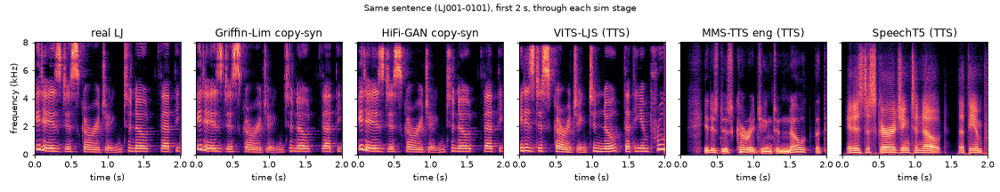
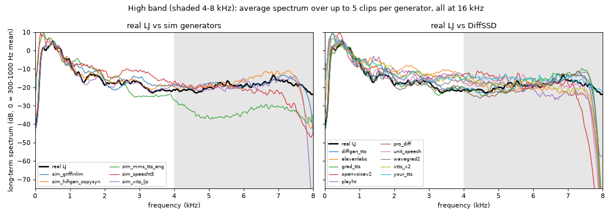
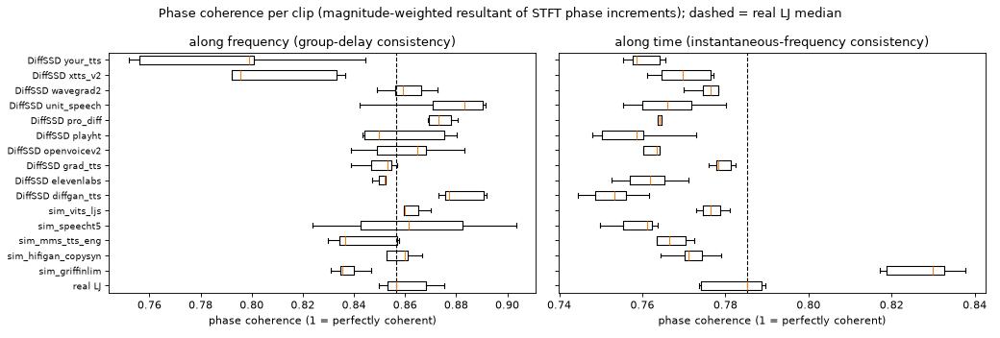
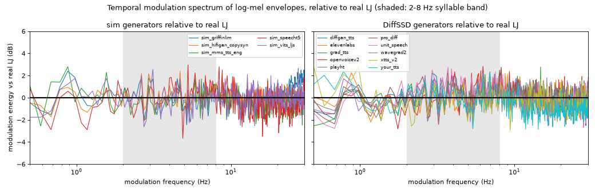

# How synthetic speech is made, and what it leaves behind

Phase 3 of HEARSAY. Goal: understand the generators behind the fakes we must detect well enough to
(1) predict which fingerprints a detector can use, and (2) generate our own **hard negatives** locally, on CPU,
with open-source models only. ElevenLabs is studied from its public docs and blog, not its API.

**TL;DR**

- Every generator in DiffSSD is some mix of *text → acoustic representation (mel or tokens) → vocoder*.
  The vocoder and the band limit it was trained at leave the most measurable traces; the acoustic model shows up
  in prosody and timing.
- We built a local simulator (`src/hearsay/sim/`, `scripts/run_sim.py`) producing up to **3,404 clips** in 5
  generators, including **copy-synthesis of the 242 real LJ clips** (same speaker, text and room; only the vocoder
  differs) and full TTS of LJSpeech sentences.
- Measured on our data (section 6): band limits separate several generators cleanly (SpeechT5 has no energy above
  7.6 kHz, MMS-TTS has a -17 dB deficit at 4-8 kHz, ElevenLabs/PlayHT/OpenVoice roll off above ~7 kHz), Griffin-Lim is
  obvious in phase statistics, but a modern HiFi-GAN copy-synthesis of LJ is **nearly indistinguishable from real LJ
  on simple spectral, phase and modulation statistics**. That is exactly why those clips are valuable training
  negatives: they force a model to learn something other than "sounds like LJ".

Contents: [1 Pipeline](#1-the-modern-tts--voice-cloning-pipeline) · [2 Voice cloning](#2-voice-cloning) ·
[3 ElevenLabs](#3-elevenlabs-what-is-public-and-what-is-inferred) · [4 DiffSSD generators](#4-the-diffssd-generators) ·
[5 Artifact catalogue](#5-artifact-catalogue) · [6 Our simulator](#6-our-simulator) · [7 Limits](#7-limitations-and-open-issues) ·
[References](#references)

---

## 1. The modern TTS / voice-cloning pipeline

```
text ──► normalization ──► G2P / phonemes ──► acoustic model ──► mel spectrogram ──► vocoder ──► waveform ──► post-processing
          ("Dr." → doctor)   (espeak, lexicon)   Tacotron / FastSpeech /   or discrete        Griffin-Lim /        loudness norm,
                                                  VITS / diffusion /        codec tokens       WaveNet / HiFi-GAN /  resampling,
                                                  flow matching / codec LM                     BigVGAN / diffusion   MP3/Opus codec
                         speaker identity ──► speaker embedding (d-vector / x-vector / ECAPA) or audio prompt ──┘
```

| Stage | What it does | Main families (examples) |
|---|---|---|
| Text normalization | Expand numbers, abbreviations, symbols to words | Rule-based (e.g. Tacotron "english_cleaners"), WFST, or learned by an LLM front end |
| G2P | Letters → phonemes (+ stress) | espeak-ng, CMUdict lookup, neural G2P; character-input models skip it (MMS, SpeechT5) |
| Acoustic model | Phonemes → frame-level acoustic features, including duration, pitch, energy | Autoregressive attention: Tacotron 2 [1], SpeechT5 [17]. Non-autoregressive with duration predictor: FastSpeech 2 [2]. Flow/VAE: Glow-TTS [3], VITS [4]. Diffusion: Grad-TTS [5], ProDiff [6], DiffGAN-TTS [7]. Flow matching: Voicebox [8], F5-TTS [9]. Codec language models: VALL-E [10], XTTS [14] |
| Intermediate | What the acoustic model outputs | 80-bin log-mel at 22.05/24 kHz is the de-facto standard; codec LMs output discrete tokens of a neural codec (EnCodec [11], VQ-VAE) |
| Vocoder | Features → waveform, i.e. invent the phase and the fine structure the mel threw away | Griffin-Lim [12] (iterative phase estimate); WaveNet [13] (autoregressive); GAN: HiFi-GAN [15], BigVGAN [16]; diffusion: WaveGrad [18], DiffWave [19]; end-to-end models (VITS, WaveGrad 2 [20]) fold the vocoder in |
| Post-processing | Make it product-ready | Loudness normalization, trimming, resampling to the delivery rate, lossy encoding (ElevenLabs default is MP3 44.1 kHz [22]) |

Key point for detection: the mel spectrogram discards phase and averages fine spectral detail into 80 bands.
Everything the vocoder puts back (phase, harmonic fine structure, noise in the high band) is *generated*, and each
vocoder generates it in its own characteristic way. That is why vocoder artifacts generalize better across acoustic
models than across vocoders [23, 24].

## 2. Voice cloning

| Approach | How the target voice enters | Data needed | Examples |
|---|---|---|---|
| Speaker-adaptive fine-tuning | Fine-tune the TTS on the target speaker | Minutes to hours, transcribed or not | UnitSpeech [25] (untranscribed, via self-supervised units); "professional" cloning services |
| Speaker embedding (zero-shot) | A fixed vector from a speaker-verification encoder conditions the model | 3-30 s | d-vector/GE2E [26], x-vector [27], ECAPA-TDNN [28]; YourTTS [21], SpeechT5 + x-vectors [17] |
| Audio prompting / in-context | The reference audio (or its codec tokens) is a prefix the model continues | 3-10 s | VALL-E [10], XTTS v2 [14], F5-TTS [9] |
| Voice conversion after TTS | A base TTS speaks, then a converter maps the timbre to the target | Short reference | OpenVoice's tone-color converter [29] |

Embedding-based cloning copies timbre (formant layout, spectral tilt, average pitch) but not the speaker's
idiosyncratic prosody, breathing, or recording channel; prompting copies more of the prompt's channel and style,
including its noise and codec. Both inherit the vocoder of the underlying model.

## 3. ElevenLabs: what is public, and what is inferred

**Publicly stated** (ElevenLabs docs and blog):

| Fact | Source |
|---|---|
| Current TTS models: Eleven v3 (70+ languages, most expressive, inline "audio tags" such as `[whispers]`), Multilingual v2 (29 languages, "lifelike, consistent quality"; the API default), Flash v2 / v2.5 (~75 ms model latency, for real time) | [22], [31] |
| Output formats are `codec_samplerate_bitrate`: default `mp3_44100_128`; also `mp3_22050_32` ... `mp3_44100_192`, `pcm_8000` ... `pcm_48000`, `ulaw_8000`, `alaw_8000`, Opus. 44.1 kHz PCM needs a Pro tier | [32], [33] |
| Instant Voice Cloning uses < 2 min of audio; Professional Voice Cloning uses "extended training audio" (Creator tier+); Voice Design builds a voice from a text description | [34] |
| Speech-to-speech ("voice changer") models exist (`eleven_multilingual_sts_v2`) | [22] |
| No architecture paper, parameter count, or training-data description has been published | [22] (docs give only qualitative descriptions) |

**Inferred** (our reading, not confirmed by ElevenLabs):

- *Model family.* Instant cloning from < 2 min without a training job, strong context-dependent prosody, and
  audio-tag control are the signature of a large autoregressive or in-context model over audio tokens
  (codec-LM / VALL-E-style lineage [10]) rather than a FastSpeech-style duration model. Professional cloning
  taking hours and "extended audio" suggests per-voice fine-tuning.
- *Which model is in DiffSSD.* DiffSSD was assembled in 2024 [30]; the default then was Multilingual v2, so its
  ElevenLabs clips are most likely Multilingual v2 (or v1/Turbo) with Instant Voice Cloning of LibriSpeech speakers.
- *Channel.* The DiffSSD ElevenLabs files we have are MP3 at 44.1 kHz (verified locally, table 4), i.e. the API
  default. An MP3 encoder at 128 kbit/s low-passes around 16-20 kHz, which is invisible after our 16 kHz resample,
  but MP3's frame structure (1152-sample granules, psychoacoustic quantization) can still leave traces in the
  0-8 kHz band. Our measured roll-off above ~7 kHz (figure `sim_highband.png`) comes from the generator, not the
  16 kHz resample (which cuts at 8 kHz).
- *Detection-relevant consequence.* ElevenLabs voices inherit the channel of the cloned LibriSpeech reference
  (read audiobook speech), so "sounds like an audiobook" is not a usable real/fake cue; a detector must rely on
  generation artifacts.

## 4. The DiffSSD generators

DiffSSD [30] has 8 open-source and 2 commercial generators. Pre-trained single-speaker (PT) models were run on LJ
Speech (5,000 clips each); zero-shot (ZS) models clone 10 LibriSpeech speakers (500 lines each). Text: 5,000
ChatGPT-3.5 sentences (~17 words each). The paper does not say which vocoder each generator used; the vocoder
column below is from each model's original paper / official repo (**checkpoint choice in DiffSSD is inferred**).
"Observed" columns are measured on our copy of the data (`data/raw/diffssd`, first file of each generator).

| Generator | Type | Acoustic model family | Vocoder | Native SR (paper) | Observed file SR / format | Clips (ours) |
|---|---|---|---|---|---|---|
| diffgan_tts | PT, LJ | FastSpeech 2-style encoder + denoising-diffusion **GAN** decoder (few steps) [7] | HiFi-GAN (official repo) [7, 15] | 22.05 kHz | 22.05 kHz PCM16 WAV | 5,000 |
| grad_tts | PT, LJ | Glow-TTS-style encoder with monotonic alignment + **score-based diffusion** mel decoder [5] | HiFi-GAN [5, 15] | 22.05 kHz | 22.05 kHz PCM16 WAV | 5,000 |
| pro_diff | PT, LJ | **Progressive distilled diffusion** (2 steps), FastSpeech-style variance adaptor [6] | HiFi-GAN [6] | 22.05 kHz | 22.05 kHz PCM16 WAV | 5,000 |
| wavegrad2 | PT, LJ | Tacotron-2 encoder + duration + **diffusion directly on the waveform** (no separate vocoder) [20] | none (end-to-end) | 24 kHz in paper; open LJ re-implementation 22.05 kHz | 22.05 kHz PCM16 WAV | 5,000 |
| unit_speech | ZS (adapted) | Multi-speaker **Grad-TTS diffusion** decoder, fine-tuned per speaker with self-supervised (HuBERT k-means) units from untranscribed speech [25] | universal HiFi-GAN (pre-trained, official) [15, 25] | 22.05 kHz | 22.05 kHz PCM16 WAV | 5,000 |
| xtts_v2 | ZS | **Autoregressive GPT-2 LM (443M) over VQ-VAE mel codes at 21.5 Hz**, Perceiver-resampler speaker conditioning from the reference [14] | HiFi-GAN (26M) decoding GPT latents, speaker-conditioned [14] | 24 kHz | 24 kHz PCM16 WAV | 5,000 |
| your_tts | ZS | **VITS** (VAE + flow + adversarial) with speaker-encoder conditioning [21] | built-in HiFi-GAN decoder (end-to-end) | 16 kHz | 16 kHz PCM16 WAV | 5,000 |
| openvoicev2 | ZS | Base TTS (MeloTTS, VITS-family) + **flow-based tone-color converter** [29] | built-in (VITS-family decoder) | 22.05 kHz | 22.05 kHz PCM16 WAV; 5 accents (`en-au`, ...) | 25,000 |
| elevenlabs | ZS, commercial | Undisclosed; likely codec/LM-style (see section 3) | undisclosed | 44.1 kHz default | **MP3** 44.1 kHz | 5,000 |
| playht | ZS, commercial | "LLM" over "MEL tokens", 1M+ hours of speech (PlayHT 2.0 blog) [35] | undisclosed | 24 kHz | **MP3 stream inside a `.wav` name**, 24 kHz | 5,000 |

Takeaways for modeling: (a) four PT generators share LJ's voice and text domain with our only real data, so they are
the channel-matched negatives the master plan asks for; (b) the LJ-trained generators mostly share one vocoder
family (HiFi-GAN), so a detector that only learns "HiFi-GAN" would still miss XTTS/ElevenLabs/PlayHT; (c) two
generators arrive as MP3, so codec traces are confounded with "commercial" and must be neutralized by applying
codec augmentation to both classes (phase 6).

## 5. Artifact catalogue

Pipeline stage → fingerprint → how a detector can see it. "Seen here" points to our own measurement where we have
one.

| Stage | Fingerprint | Why it happens | Detector view | Seen here |
|---|---|---|---|---|
| Text front end | Mispronounced rare words, wrong stress, flat question intonation | G2P / normalization errors | ASR-free is hard; prosody features (F0 contour at phrase ends), or ASR confidence | - |
| Acoustic model (duration) | Over-regular phone durations and pauses; no hesitations, fillers, restarts | Duration predictor regresses to the mean | Rhythm statistics: variance of syllable rate, pause-length distribution; modulation spectrum at 2-8 Hz | `sim_modulation.png` |
| Acoustic model (mel regression) | Over-smoothed spectra: blurred formant transitions, weak high-band detail | L1/L2 loss on mels averages plausible outputs | Spectral flux, formant-transition sharpness, high-band variance | `sim_stages.png` |
| Acoustic model (missing physiology) | No breaths, lip smacks, micro-jitter/shimmer patterns of a real glottis | Rarely in the training targets, or smoothed away | Breath detection, jitter/shimmer, HNR (see `docs/speech_biology.md`, phase 4) | - |
| Mel bottleneck | Hard band edge at the mel `fmax` | Nothing above `fmax` is represented, so the vocoder cannot produce it | Long-term spectrum above the edge; energy ratio 7-8 kHz | SpeechT5 (`fmax` 7.6 kHz): -33 dB at 7-8 kHz vs -19 dB real |
| Native sample rate / training data band | Roll-off or empty band above the generator's Nyquist or its training data's bandwidth | Model trained at 16/22.05/24 kHz or on band-limited data | Spectrum shape above 4 kHz; after resampling to 16 kHz only edges < 8 kHz remain visible | MMS-TTS: -17 dB at 4-8 kHz; ElevenLabs, PlayHT, OpenVoice roll off > 7 kHz (`sim_highband.png`) |
| Vocoder: phase | Griffin-Lim: incoherent ("phasey", metallic) phase; neural vocoders: plausible phase but not physically consistent with a glottal source | Phase is estimated, not measured | Group delay, instantaneous-frequency deviation, relative phase shift; raw-waveform models | Griffin-Lim clearly off in both phase-coherence statistics; neural vocoders close to real (`sim_phase.png`) |
| Vocoder: upsampling | Periodic spectral peaks / "checkerboard" at multiples of `sr / hop` and of each transposed-conv stride | Transposed convolutions and zero-insertion upsampling create tonal aliasing [36] | Fine-resolution LTAS peaks, cepstral peaks at the hop period, CNN on high-res spectrograms | - |
| Vocoder: GAN | Slight high-band noise-floor texture, "buzz" on voiced fricatives | Multi-period / multi-scale discriminators leave characteristic noise | LFCC / CQCC front ends; high-band subband classifiers [23, 24] | - |
| Diffusion (acoustic or waveform) | Residual Gaussian noise in silences and the high band when few steps are used | Imperfect denoising in fast samplers | Noise floor in pauses; spectral flatness in silences | DiffGAN-TTS / Grad-TTS carry *more* 4-8 kHz energy than real (`sim_highband.png`) |
| Codec LM | Token-rate periodicity (XTTS: 21.5 Hz codes; EnCodec: 50-75 Hz frames), codec quantization noise; occasional repeats/skips | Discrete token bottleneck; autoregressive sampling | Modulation near the token rate; codec re-encoding residual | - |
| Post-processing | Exact digital silence at edges, peak-normalized level, MP3 frame traces | Product pipeline | Trim silence and normalize level before modeling (to remove shortcuts), then codec-augment both classes | DiffSSD ElevenLabs/PlayHT are MP3 |

Shortcut warning (not a spoof artifact, a dataset artifact): leading/trailing silence length and level differ by
source in ASVspoof-style datasets and models learn them [24]. Our sim clips are level-matched (copy-synthesis to its
source clip, TTS to the median real-LJ RMS) but not trimmed; every clip, real or fake, goes through
`hearsay.preprocess.prep()` (DC removal, trim, 7 kHz low-pass, RMS normalization) before any model sees it.

## 6. Our simulator

### What it generates

`scripts/run_sim.py` (CPU; the full set was generated as 3 parallel processes with 1 torch thread each, one per
group of generators) writes 16 kHz mono PCM16 WAVs to `data/processed/sim/<generator>/` and
`data/processed/manifests/sim.parquet` (`audio.MANIFEST_COLUMNS`, `label = spoof`, `source = sim`, all clips ≥ 3 s).
It is resumable: wavs are written atomically and kept, clips that come out shorter than 3 s are logged in
`<generator>/_skipped.txt` and not re-synthesized, and the manifest is rebuilt from the wavs on disk for *every*
generator on each run, so a partial or `--only` run cannot leave it stale.

| Generator | Kind | Model / vocoder | Native SR | Planned clips | Speakers |
|---|---|---|---|---|---|
| `sim_griffinlim` | copy-synthesis of real LJ | 80-bin mel → Griffin-Lim (32 it.) | 16 kHz | 242 + 300 | LJ |
| `sim_hifigan_copysyn` | copy-synthesis of real LJ | SpeechT5 log-mel → HiFi-GAN V1 | 16 kHz | 242 + 300 | LJ |
| `sim_griffinlim_copysyn_libri` | copy-synthesis of real LibriSpeech | 80-bin mel → Griffin-Lim (32 it.) | 16 kHz | 600 | LibriSpeech speakers |
| `sim_hifigan_copysyn_libri` | copy-synthesis of real LibriSpeech | SpeechT5 log-mel → HiFi-GAN V1 | 16 kHz | 600 | LibriSpeech speakers |
| `sim_vits_ljs` | full TTS | VITS (LJ-trained), built-in HiFi-GAN decoder | 22.05 kHz | 1,500 | LJ (synthetic) |
| `sim_mms_tts_eng` | full TTS | VITS (MMS English) | 16 kHz | 1,000 | 1 MMS voice |
| `sim_speecht5` | full TTS | SpeechT5 AR transformer → HiFi-GAN | 16 kHz | 420 | 7 CMU ARCTIC x-vectors |

**Status at PR time:** generation was interrupted partway (shared CPU); griffinlim 242/242, hifigan ~142/242,
mms ~262/1000, vits_ljs and speecht5 smoke-test only. `run_sim.py` is resumable: re-running it completes the set
and rewrites `sim.parquet`. Figures/stats below were produced on a 5-clip-per-generator smoke sample and must be
regenerated with `scripts/sim_figures.py --n 60` after the full run.

- **Copy-synthesis** (`src/hearsay/sim/copysyn.py`) takes a real clip, computes an 80-bin mel, and re-synthesizes
  it. Sources: the 242 `lj_real` clips, plus 900 real clips sampled from the `librispeech` and `ljspeech` sources
  (per split: train 600, val 150, test_internal 150; 2/3 LibriSpeech, 1/3 LJSpeech; frozen in
  `data/processed/sim/_copysyn_sources.parquet`). Each vocoded clip copies `text_id` and `speaker` verbatim from its
  source row, so `make_splits` puts it in the same split as its real original, and "vocoded = fake" is no longer
  confounded with "LJ's voice": the LibriSpeech copies are 400+ other speakers. It Output is length- and RMS-matched to the source clip so duration and level are not class
  cues. Griffin-Lim uses a 1024/256 STFT and 32 iterations; HiFi-GAN uses the SpeechT5 feature extractor's exact mel
  settings (80 bins, 80-7600 Hz, 1024/256 at 16 kHz, log10) feeding `microsoft/speecht5_hifigan`.
- **Full TTS** (`src/hearsay/sim/tts.py`) speaks LJSpeech transcripts (NVIDIA Tacotron 2 filelists; 10,599
  sentences left after dropping digits/symbols and keeping 60-220 characters). The 220 real LJ ids with clean text
  come first, so every TTS generator has the *same sentence* as a real clip (pairs share `text_id`; group splits
  by `text_id` to avoid text leakage). VITS and SpeechT5 sample latents/dropout, so each clip is seeded by its index.
  TTS output has no paired reference level, so it is scaled to RMS 0.063 (the median of the 242 real LJ clips).
  - `sim_vits_ljs`: `kakao-enterprise/vits-ljs`, VITS trained on LJ, i.e. **a TTS clone of our real speaker**.
    Phonemized with espeak-ng (via `phonemizer` + `espeakng-loader`), 22.05 kHz → resampled to 16 kHz.
  - `sim_mms_tts_eng`: `facebook/mms-tts-eng` [37], VITS trained on read religious text, character input, 16 kHz.
  - `sim_speecht5`: `microsoft/speecht5_tts` [17] (autoregressive transformer → mel → HiFi-GAN), voice set by
    x-vectors of the 7 CMU ARCTIC speakers, 60 clips each.

Not done, and why: Piper/Kokoro/XTTS (more installs, larger CPU cost for similar coverage; VITS and SpeechT5 cover
the flow/VAE and autoregressive-mel families); codec variants of sim clips (a codec applied only to fakes would
create a shortcut; phase 6 applies codecs to both classes).

### What it looks like



`sim_stages.png`: the same LJ sentence as real audio, two copy-syntheses and three TTS systems. Copy-synthesis keeps
the exact timing and formants, so the two copies are hard to tell from the original by eye; MMS-TTS is visibly
darker above ~3 kHz and SpeechT5 has an empty strip above 7.6 kHz.



`sim_highband.png`: average spectrum per generator (smoke sample: 5 clips each), normalized at 300-1000 Hz. Real LJ, both
copy-syntheses and VITS-LJS overlap almost everywhere; SpeechT5, MMS-TTS and the commercial/zero-shot DiffSSD
generators (ElevenLabs, PlayHT, OpenVoice) separate in the 7-8 kHz band. A high-band feature is cheap and useful,
but it only catches some generators.



`sim_phase.png`: per-clip phase coherence along frequency (group-delay consistency) and along time
(instantaneous-frequency consistency). Griffin-Lim is the outlier (its phase is too consistent over time and too
inconsistent over frequency); every neural vocoder sits within the real-speech spread, so crude phase statistics
will not catch modern generators on their own.



`sim_modulation.png`: temporal modulation spectrum of log-mel envelopes relative to real LJ. Differences stay
within a few dB and mostly reflect speaking rate and pausing, so rhythm is at best a weak, speaker-confounded cue.

### Numbers behind the figures

Printed by `scripts/sim_figures.py` (`hf_*` = share of energy above the frequency, dB; `mod_4hz_share` =
share of modulation energy at 2-8 Hz; coherence in [0, 1]).

Smoke-sample values (n = 5 per group; indicative only):

| group | hf 4-8k dB | hf 7-8k dB | 2-8 Hz mod share | GD coherence | IF coherence |
|---|---|---|---|---|---|
| real LJ | -13.3 | -19.0 | 0.346 | 0.861 | 0.782 |
| sim_griffinlim | -13.1 | -17.7 | 0.339 | 0.838 | 0.827 |
| sim_hifigan_copysyn | -13.5 | -18.6 | 0.339 | 0.857 | 0.776 |
| sim_vits_ljs | -13.7 | -18.3 | 0.330 | 0.863 | 0.777 |
| sim_mms_tts_eng | -30.7 | -37.8 | 0.335 | 0.838 | 0.766 |
| sim_speecht5 | -19.0 | -32.7 | 0.319 | 0.863 | 0.758 |
| DiffSSD elevenlabs | -19.5 | -33.3 | 0.349 | 0.859 | 0.759 |
| DiffSSD playht | -17.6 | -30.2 | 0.358 | 0.864 | 0.764 |
| DiffSSD openvoicev2 | -16.3 | -34.1 | 0.370 | 0.861 | 0.761 |
| DiffSSD grad_tts | -9.8 | -12.1 | 0.374 | 0.852 | 0.778 |
| DiffSSD diffgan_tts | -11.0 | -14.9 | 0.399 | 0.873 | 0.756 |
| DiffSSD xtts_v2 | -14.1 | -24.0 | 0.329 | 0.807 | 0.772 |
| DiffSSD your_tts | -14.6 | -21.9 | 0.342 | 0.798 | 0.757 |

## 7. Limitations and open issues

- Copy-synthesis now covers LJ and ~400 LibriSpeech speakers, but all of it is read audiobook speech; the full-TTS
  generators still speak only LJSpeech text.
- Only one neural vocoder (HiFi-GAN V1 via SpeechT5) is used for copy-synthesis; a BigVGAN or diffusion vocoder
  would widen coverage beyond the HiFi-GAN family that dominates DiffSSD.
- MMS-TTS weights are CC-BY-NC 4.0; fine for this non-commercial challenge, recorded in the manifest `license`.
- DiffSSD vocoder assignments are from the original papers/repos; the DiffSSD paper does not state them.
- Sim clips are not silence-trimmed; `hearsay.preprocess.prep()` trims every clip at model time.
- The copy-synthesis sample is drawn from the current `manifest.parquet` splits and frozen; the sim rows follow their
  source's `text_id` group, so they stay in the same split as long as the split hash rule is unchanged.

## References

1. Shen et al., *Natural TTS Synthesis by Conditioning WaveNet on Mel Spectrogram Predictions* (Tacotron 2), ICASSP 2018. arXiv:1712.05884
2. Ren et al., *FastSpeech 2*, ICLR 2021. arXiv:2006.04558
3. Kim et al., *Glow-TTS*, NeurIPS 2020. arXiv:2005.11129
4. Kim, Kong, Son, *Conditional Variational Autoencoder with Adversarial Learning for End-to-End TTS* (VITS), ICML 2021. arXiv:2106.06103
5. Popov et al., *Grad-TTS: A Diffusion Probabilistic Model for Text-to-Speech*, ICML 2021. arXiv:2105.06337
6. Huang et al., *ProDiff: Progressive Fast Diffusion Model for High-Quality TTS*, ACM MM 2022. arXiv:2207.06389
7. Liu et al., *DiffGAN-TTS: High-Fidelity and Efficient TTS with Denoising Diffusion GANs*, 2022. arXiv:2201.11972
8. Le et al., *Voicebox*, NeurIPS 2023. arXiv:2306.15687
9. Chen et al., *F5-TTS*, 2024. arXiv:2410.06885
10. Wang et al., *Neural Codec Language Models are Zero-Shot TTS Synthesizers* (VALL-E), 2023. arXiv:2301.02111
11. Défossez et al., *High Fidelity Neural Audio Compression* (EnCodec), 2022. arXiv:2210.13438
12. Griffin & Lim, *Signal Estimation from Modified Short-Time Fourier Transform*, IEEE TASSP 1984
13. van den Oord et al., *WaveNet*, 2016. arXiv:1609.03499
14. Casanova et al., *XTTS: a Massively Multilingual Zero-Shot TTS Model*, Interspeech 2024. arXiv:2406.04904
15. Kong, Kim, Bae, *HiFi-GAN*, NeurIPS 2020. arXiv:2010.05646
16. Lee et al., *BigVGAN*, ICLR 2023. arXiv:2206.04658
17. Ao et al., *SpeechT5*, ACL 2022. arXiv:2110.07205; checkpoints `microsoft/speecht5_tts`, `microsoft/speecht5_hifigan`
18. Chen et al., *WaveGrad*, ICLR 2021. arXiv:2009.00713
19. Kong et al., *DiffWave*, ICLR 2021. arXiv:2009.09761
20. Chen et al., *WaveGrad 2: Iterative Refinement for TTS*, Interspeech 2021. arXiv:2106.09660
21. Casanova et al., *YourTTS*, ICML 2022. arXiv:2112.02418
22. ElevenLabs, *Models* documentation. https://elevenlabs.io/docs/overview/models
23. Frank & Schönherr, *WaveFake: A Data Set to Facilitate Audio Deepfake Detection*, NeurIPS D&B 2021. arXiv:2111.02813
24. Müller et al., *Does Audio Deepfake Detection Generalize?*, Interspeech 2022. arXiv:2203.16263; see also Wang & Yamagishi, *Spoofed training data ... can be efficiently created using neural vocoders*, ICASSP 2023, arXiv:2210.10570, and Sun et al., *AI-Synthesized Voice Detection Using Neural Vocoder Artifacts*, CVPRW 2023, arXiv:2304.13085 (the copy-synthesis idea used here)
25. Kim et al., *UnitSpeech: Speaker-adaptive Speech Synthesis with Untranscribed Data*, Interspeech 2023. arXiv:2306.16083
26. Wan et al., *Generalized End-to-End Loss for Speaker Verification* (d-vector), ICASSP 2018. arXiv:1710.10467
27. Snyder et al., *X-Vectors: Robust DNN Embeddings for Speaker Recognition*, ICASSP 2018
28. Desplanques et al., *ECAPA-TDNN*, Interspeech 2020. arXiv:2005.07143
29. Qin et al., *OpenVoice: Versatile Instant Voice Cloning*, 2023. arXiv:2312.01479
30. Bhagtani et al., *DiffSSD: A Diffusion-Based Dataset for Speech Forensics*, ICASSP 2025. arXiv:2409.13049
31. ElevenLabs, *Eleven v3* announcement. https://elevenlabs.io/blog/eleven-v3
32. ElevenLabs, *Create speech* API reference (`output_format`). https://elevenlabs.io/docs/api-reference/text-to-speech/convert
33. ElevenLabs, *PCM output format* blog. https://elevenlabs.io/blog/pcm-output-format
34. ElevenLabs, *Voices* capability docs. https://elevenlabs.io/docs/overview/capabilities/voices
35. PlayHT, *Introducing PlayHT 2.0*. https://play.ht/news/introducing-play-ht-2-0/
36. Pons et al., *Upsampling Artifacts in Neural Audio Synthesis*, ICASSP 2021. arXiv:2010.14356
37. Pratap et al., *Scaling Speech Technology to 1,000+ Languages* (MMS), 2023. arXiv:2305.13516
