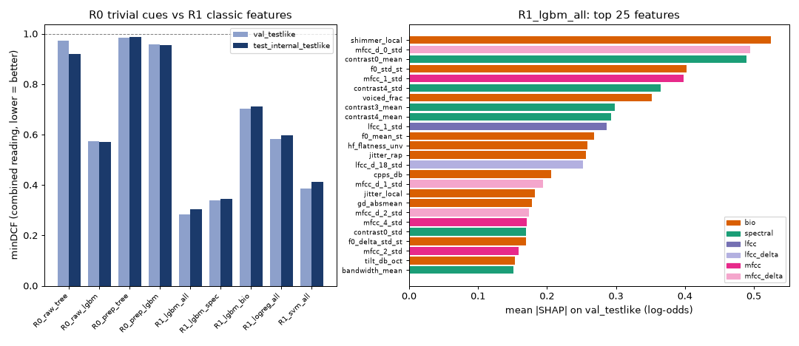

# R0 / R1: trivial cues and classic ML

Rungs R0 and R1 of the modeling ladder ([development log](../docs/00_development_log.md), stage 6). R0 asks how much of the dataset can be
separated by cues that have nothing to do with speech, and whether `prep()` removes them. R1 is the interpretable
classic baseline: cepstral and spectral statistics plus the 48 Stage-4 biology features, fed to LightGBM, logistic
regression and an RBF SVM.

**Headline.** The best model is `R1_lgbm_all` (LightGBM on 228 features). It scores **combined minDCF 0.305** on
`test_internal_testlike` (official 0.293, brief 0.316, EER 8.0%) and 0.282 on `val_testlike`, the set used for model
selection. Before `prep()`, trivial cues alone reach 0.57. After `prep()` they reach 0.96, which is almost chance.
The biology features are the largest SHAP family (31%), and adding them to the spectral set improves minDCF by 0.04.



## Setup

| | |
|---|---|
| Train | `split=='train'`: all 43,865 train reals, plus 30,000 fakes spread evenly over 138 source/generator cells (`extract_bio.even`). Total 73,865 clips. |
| Eval | every row of `val`, `val_testlike`, `test_internal_testlike` (27,718 clips) |
| Input | canonical 16 kHz WAV → train only: `augment()` (class-symmetric) → `prep()` → crop. Train crops are random 3–4 s; eval and HGT crops are the center ≤ 4 s (test median is 3.4 s). |
| R0 features | the 9 `hearsay.data.stats.clip_stats` cues (duration, peak, RMS, clip fraction, DC, leading/trailing silence, rolloff95, bw60). `raw_*` is computed on the full raw clip; `prep_*` is computed on the exact model input above. |
| R1 features | `hearsay.features.spectral` (180): LFCC and MFCC with 20 coefficients plus deltas, mean and std of each; centroid, bandwidth, rolloff, flatness and 6-band contrast (mean/std). **All of it is computed on 0–7 kHz only**, because the 10th-order low-pass in `prep()` still leaves the 7–8 kHz shortcut band at about −20 dB. Plus the 48 `hearsay.features.bio` features, computed on the prepped crop. |
| Selection | LightGBM grid (num_leaves 15/63/255) with early stopping. LR C ∈ {0.01, 0.1, 1}; SVM C ∈ {1, 10}. Every choice was made by combined minDCF on `val_testlike`. `test_internal_testlike` was never used for a decision. |
| Cost | Feature extraction takes 0.06 s per clip wall time on 4 workers (≈ 100 min for 101k clips). All training runs take ≈ 40 min on 4 threads. |

Reproduce:

```bash
PYTHONPATH=src python scripts/extract_classic.py --workers 4        # -> data/features/classic.parquet (resumable)
PYTHONPATH=src python scripts/extract_classic.py --hgt --workers 4  # -> data/features/classic_hgt.parquet (inference only)
PYTHONPATH=src python scripts/train_classic.py --threads 4          # leaderboard rows, scores, analysis, figure
```

## Results

Rows are minDCF (lower is better; 1.0 = constant scores) and EER.

| model | features | val_testlike combined | test_internal_testlike official | brief | **combined** | EER % |
|---|---|---:|---:|---:|---:|---:|
| R0_raw_tree | 9 trivial cues, raw clip, depth-3 tree | 0.973 | 1.000 | 0.840 | 0.920 | 47.1 |
| R0_raw_lgbm | 9 trivial cues, raw clip | 0.574 | 0.634 | 0.510 | **0.572** | 18.8 |
| R0_prep_tree | 9 trivial cues after prep, depth-3 tree | 0.983 | 1.000 | 0.977 | 0.989 | 53.5 |
| R0_prep_lgbm | 9 trivial cues after prep | 0.957 | 0.939 | 0.972 | **0.955** | 38.7 |
| R1_lgbm_bio | 48 bio | 0.704 | 0.703 | 0.723 | 0.713 | 20.7 |
| R1_logreg_all | 228, standardized, C=0.01 | 0.583 | 0.583 | 0.612 | 0.597 | 17.0 |
| R1_svm_all | 228, RBF, 15k balanced subsample | 0.387 | 0.406 | 0.420 | 0.413 | 11.9 |
| R1_lgbm_spec | 180 spectral/cepstral | 0.340 | 0.332 | 0.359 | 0.346 | 9.8 |
| R1_lgbm_nolow | 226 (no 0–200 Hz contrast) | 0.286 | 0.318 | 0.328 | 0.323 | 8.7 |
| **R1_lgbm_all** | **228 (spectral + bio)** | **0.282** | **0.293** | **0.316** | **0.305** | **8.0** |

`R1_lgbm_all` uses num_leaves=255 and stops at 799 trees. The gap between `val_testlike` and the test set is small
(0.28 vs 0.30), so selection did not overfit much.

### Per-source breakdown (`test_internal_testlike`, combined minDCF)

The "real" rows score one source's real clips against all fakes. The "fake" rows score one source's fakes against
all reals. Higher numbers mean that slice is harder. Full per-generator tables are in
`data/scores/r1_analysis/<model>_per_source.csv`.

| side | source | n | R0_raw_lgbm | R0_prep_lgbm | R1_lgbm_spec | R1_lgbm_bio | R1_lgbm_all |
|---|---|---:|---:|---:|---:|---:|---:|
| real | asvspoof5 | 234 | 0.857 | 0.996 | 0.733 | 0.937 | **0.663** |
| real | librisevoc | 276 | 0.788 | 0.992 | 0.559 | 0.884 | 0.537 |
| real | asvspoof2019_la | 829 | 0.662 | 0.586 | 0.512 | 0.680 | 0.391 |
| real | cvoicefake_en | 425 | 0.447 | 0.960 | 0.413 | 0.775 | 0.377 |
| real | dfadd | 45 | 0.565 | 0.898 | 0.280 | 0.901 | 0.284 |
| real | librispeech | 1669 | 0.376 | 0.998 | 0.322 | 0.695 | 0.261 |
| real | sonar | 240 | 0.652 | 0.978 | 0.196 | 0.655 | 0.198 |
| real | in_the_wild | 1342 | 0.667 | 0.895 | 0.114 | 0.655 | 0.187 |
| real | ljspeech | 1166 | 0.476 | 0.860 | 0.181 | 0.646 | 0.181 |
| real | lj_real (organizers' LJ) | 29 | 0.343 | 0.795 | 0.155 | 0.646 | 0.167 |
| real | mlaad_tiny | 568 | **0.003** | 0.861 | 0.161 | 0.542 | 0.159 |
| fake | in_the_wild | 49 | 0.819 | 0.950 | 0.555 | 0.892 | **0.530** |
| fake | cvoicefake_en | 58 | 0.365 | 0.833 | 0.759 | 0.760 | 0.475 |
| fake | librisevoc | 146 | 0.204 | 0.512 | 0.555 | 0.687 | 0.463 |
| fake | mlaad_tiny | 74 | 0.348 | 0.922 | 0.535 | 0.801 | 0.438 |
| fake | diffssd | 2151 | 0.589 | 0.951 | 0.304 | 0.712 | 0.283 |
| fake | asvspoof2019_la | 121 | 0.484 | 0.981 | 0.356 | 0.578 | 0.214 |
| fake | asvspoof5 | 133 | 0.174 | 0.744 | 0.217 | 0.358 | 0.198 |
| fake | wavefake | 142 | 0.594 | 0.940 | 0.161 | 0.719 | 0.159 |
| fake | sonar | 20 | 0.338 | 0.747 | 0.133 | 0.759 | 0.139 |
| fake | dfadd | 30 | 0.289 | 0.766 | 0.007 | 0.210 | 0.003 |
| held-out gen | diffgan_tts | 455 | 0.853 | 0.916 | 0.000 | 0.486 | **0.000** |
| held-out gen | unit_speech | 490 | 0.548 | 0.908 | 0.304 | 0.804 | 0.322 |
| held-out gen | playht | 489 | 0.503 | 0.946 | 0.490 | 0.880 | **0.451** |

## Update: full training set (C3, 2026-09-26)

The first run capped training at all reals + 30k fakes. C3 featurized every train row (135,436 clips, 43,865 real,
now including the 3,916 finished sim fakes) and retrained with `--suffix _full` so the earlier rows stay comparable.
Eval subsets are the frozen ones (`docs/02_dataset.md`), so the numbers below are directly comparable.

| model | val_testlike combined | **test_internal_testlike** official / brief / **combined** |
|---|---|---|
| R1_lgbm_all (30k fakes) | 0.282 | 0.293 / 0.316 / **0.305** |
| **R1_lgbm_all_full** | **0.228** | 0.262 / 0.243 / **0.253** |
| R1_lgbm_spec_full | 0.282 | 0.291 / 0.279 / 0.285 |
| R1_lgbm_bio_full | 0.585 | 0.638 / 0.561 / 0.600 |
| R1_logreg_all_full | 0.503 | 0.561 / 0.502 / 0.532 |
| R0_prep_lgbm_full (trivial cues after prep) | 0.933 | 0.915 / 0.928 / 0.921 |

- 3x more fakes cut headline minDCF by 0.05 (17% relative): classic features were data-limited, not saturated.
- Bio features alone improved most (0.713 → 0.600), and still add ~0.03 on top of spectral features.
- R0 after `prep()` stays near chance (0.92), so the shortcut neutralization holds with the new sim data.
- HGT scored with `R1_lgbm_all_full` → `data/scores/R1_lgbm_all_full__hgt.parquet` (new best classic model).
- Figure: `docs/figures/r1_summary_full.png`.
- Comparability: `val_testlike` / `test_internal_testlike` are frozen, so those columns compare across runs. Plain
  `val` gained 587 sim rows, so `val` rows of `_full` models are **not** comparable with older `val` rows.
  Counts: 163,741 rows featurized in total, of which 135,436 are train.

## What it teaches us

1. **The raw data leaks, and `prep()` removes almost all of it.** The 9 trivial cues get LightGBM to 0.57 on raw
   clips. The mlaad_tiny reals are perfectly separable on raw cues (0.003). The largest gain belongs to DC offset,
   followed by leading silence, bandwidth and peak. The same cues measured on the prepped model input fall to
   0.955, close to the 1.0 of a constant score. The depth-3 tree drops from 0.92 to 0.99. One residue remains: DC
   of the prepped crop is still the top R0-prep feature. `prep()` removes DC before trimming and cropping, so sub-Hz
   drift or rumble survives in a crop. It is weak (0.955), but a gentle ~50 Hz high-pass inside `prep()` would close
   it. Suggestion for the owner of `preprocess.py`.
2. **Classic features carry real signal after the shortcuts are gone.** 0.305 on the headline set, with EER 8%.
   Some residual channel learning is expected (see 4). But the unseen DiffSSD generator `diffgan_tts` scores 0.000
   and `unit_speech` scores 0.32, and these are generators that were never trained on.
3. **Biology helps as a complement, not on its own.** Bio alone scores 0.71. Spectral alone scores 0.346, and
   spectral + bio scores 0.305. In the full model, bio is the largest SHAP family (31% of mean |SHAP|), ahead of
   spectral statistics (17%), MFCC (15 + 12% deltas) and LFCC (14 + 11%). With the channel shortcuts neutralized,
   the bio cues that matter are the ones Stage 4 predicted. Directions below are per-class medians on
   `val_testlike`:
   - **phonation micro-perturbation.** `shimmer_local` is the top feature overall. `jitter_rap` and `jitter_local`
     are higher in real speech (0.0092 vs 0.0082 rap). Vocoders produce glottal cycles that are too regular.
   - **prosodic variability.** `f0_std_st` (3.64 vs 3.11 semitones) and `f0_delta_std_st` (0.53 vs 0.42) are both
     higher in reals. TTS pitch contours are smoother.
   - **periodicity cleanliness.** `cpps_db` is lower in reals (20.2 vs 21.5 dB). Real voices are breathier and
     noisier, and `hf_flatness_unv` points the same way.
   - `voiced_frac`, `gd_absmean` (phase) and `tilt_db_oct` contribute smaller amounts.

   Formants, VTL, AM rhythm and respiration features rank low. On 3–4 s crops there are too few pauses or breaths
   to measure them reliably.
4. **Where it fails.** The hardest real sources are asvspoof5 (0.66) and librisevoc (0.54). Both corpora build their fakes from
   the same speakers and recording conditions as their reals, so channel cues cannot help, and clip-level
   statistics are too coarse to find what differs. The hardest fakes are in_the_wild (0.53), cvoicefake_en (0.48), librisevoc (0.46) and the held-out
   **playht** (0.45, MP3 commercial TTS). These are the modern and "in the wild" slices that most resemble a test
   set built from commercial cloning tools. This is where R3/R4 (AASIST, SSL embeddings) have to earn their keep.
5. **The 0–200 Hz band is not a crutch.** `contrast0_mean` (0–200 Hz peak/valley contrast) ranks 3rd by SHAP, and
   sub-200 Hz energy is mostly the recording chain. Removing it (`R1_lgbm_nolow`) moves `val_testlike` only from
   0.282 to 0.286 (test 0.305 to 0.323), so the model does not depend on it. We keep the full model, because it wins
   on the selection set.
6. **Model family.** Trees beat linear models by a wide margin (LR 0.60, SVM 0.41, LGBM 0.30), because the features
   interact with source and speaker. Logistic regression cannot condition "high jitter" on the F0 range, for example.

## HGT test

`R1_lgbm_all` (best on `val_testlike`) scores the 1,671 HGT clips from `data/features/classic_hgt.parquet`. Those
clips go through the same `prep()` and center ≤ 4 s crop, with no augmentation, and the output is written to
`data/scores/R1_lgbm_all__hgt.parquet` (columns `filename`, `score` = LightGBM P(fake)). Nothing is fit, normalized
or selected on HGT audio or on its scores.

## Shortcuts and limits

- CQCC was skipped: the constant-Q transform costs about 10× an STFT per clip. LFCC covers the same
  "linear high-frequency resolution" idea.
- The SVM is trained on a balanced subsample of 15k clips, because the kernel is O(n²). It is not competitive, so
  scaling it up is not worth the time.
- There is one augmented crop per train clip. More crops per clip (or a fresh crop per epoch) is the obvious next
  step if R1 were to be pushed further. R2/R4 are a better use of the CPU.
- The fake budget is 30k of the 70.9k train fakes. Real clips are all kept.
