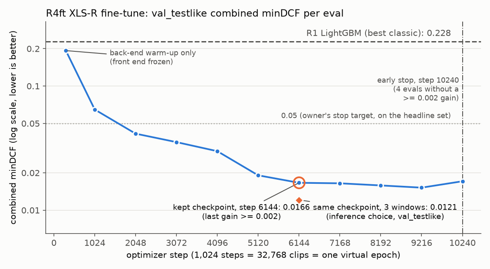

# R4ft: end-to-end XLS-R fine-tune (best model so far)

Rung R4ft of the modeling ladder, run as planned before training ([development log](../docs/00_development_log.md), stage 7). We fine-tuned a self-supervised speech front end,
`facebook/wav2vec2-xls-r-300m` cut to its first 12 transformer blocks, end to end with a small pooling head on raw
16 kHz audio. Training took one run of 2 h 24 min on an 8 GB laptop GPU.

**Headline.** `R4ft_xlsr_light` scores **combined minDCF 0.028** on `test_internal_testlike` (official 0.030, brief
0.026, EER 0.76 %). The best classic model scores 0.253 there, so this is about 9× lower. The owner's stop criterion
(headline ≤ 0.05) is met. On `val_testlike`, the set every choice was made on, it scores 0.012, and the gap between
the two sets is analysed in [§5](#5-selection-discipline-and-the-val_testlike--test_internal-gap).



_Figure: `PYTHONPATH=src python scripts/plot_r4ft_curve.py`, from the run's `log.jsonl`._

## 1. Results

minDCF: lower is better, 0 is perfect, and 1.0 is what a constant score gets. *official* and *brief* are the two
readings of the organizers' cost function, and *combined* is their mean, which is the selection metric
([`docs/01_challenge_and_scoring.md`](../docs/01_challenge_and_scoring.md) §1–§2). Every R4ft number below was recomputed from
`data/scores/R4ft_xlsr_light.parquet` with `hearsay.evaluate.evaluate()`. The R1 and R3 rows are from
[`leaderboard.md`](leaderboard.md).

| model | set | n real / fake | official | brief | **combined** | EER % |
|---|---|---|---:|---:|---:|---:|
| **R4ft_xlsr_light** | val_testlike (selection) | 6,274 / 2,689 | 0.0139 | 0.0103 | **0.0121** | 0.37 |
| **R4ft_xlsr_light** | **test_internal_testlike (headline)** | 6,823 / 2,924 | **0.0301** | **0.0262** | **0.0282** | **0.76** |
| R4ft_xlsr_light | val (all val rows) | 6,274 / 12,284 | 0.0347 | 0.0246 | 0.0297 | 0.80 |
| R1_lgbm_all_full (best classic) | val_testlike | 6,274 / 2,689 | 0.2505 | 0.2060 | 0.2283 | 6.21 |
| R1_lgbm_all_full | test_internal_testlike | 6,823 / 2,924 | 0.2624 | 0.2434 | 0.2529 | 6.57 |
| R1_lgbm_all_full | val | 6,274 / 12,284 | 0.2895 | 0.2057 | 0.2476 | 6.75 |
| R3 AASIST zero-shot (pretrained ASVspoof5 weights) | val_testlike | 6,274 / 2,689 | 0.9888 | 0.6738 | 0.8313 | 32.72 |
| R3 AASIST zero-shot | test_internal_testlike | 6,823 / 2,924 | 0.9904 | 0.6551 | 0.8227 | 32.45 |

The leaderboard number comes from `report()`; the scoring run self-checks with `evaluate()`. Both use the same
metric code, and the numbers above match the self-check printed at scoring time (`data/models/r4ft_xlsr/run1_score.log`).

## 2. Model and recipe

The architecture is drawn in [`docs/06_architecture.md`](../docs/06_architecture.md). In brief:

| | |
|---|---|
| Front end | XLS-R-300M, **first 12 of 24 blocks** (same truncation as `SSLEmbedder(max_blocks=)`). The conv feature encoder is frozen and runs under `no_grad`. All 12 blocks, the feature projection and the positional conv are trainable: 160.4 M parameters. |
| Back end ("light", A) | Learned softmax weights over the 13 hidden states → Linear 1024→256 → attentive statistics pooling → 1 spoof logit. BCE loss. Score = logit, higher = more fake. |
| Precision / memory | bf16 autocast, fp32 master weights and fp32 AdamW. Non-reentrant gradient checkpointing on the blocks, SDPA attention. `set_per_process_memory_fraction(0.92)`, so an over-allocation raises OOM instead of silently spilling to shared memory under Windows WDDM. |
| Batching | Micro-batch 8 (4 real + 4 fake) × 4 accumulation = 32 clips per optimizer step. |
| Sampling | Train rows only. Cells are (source, label), drawn ∝ √n, and generators within a fake cell are drawn ∝ √n. **asvspoof5 reals ×2** was taken from R1's `val_testlike` slices ([`03_error_analysis.md`](03_error_analysis.md)). |
| Optimizer | AdamW (0.9, 0.98), weight decay 0.01. Front-end top LR 2e-5 with layer-wise decay 0.85 per block downward. Back-end LR 1e-3. Grad clip 1.0. |
| Schedule | 300 steps with the front end frozen (back-end warm-up), then 500 steps of linear warm-up, then cosine to 5 % over 16 virtual epochs of 1,024 steps. Early stopping ended the run at step 10,240. |
| Regularization | HF time masking p = 0.05, length 10. Dropout 0.1. Layerdrop 0. |
| Input pipeline | Train: 6 s pre-crop → class-symmetric `augment()` (MP3 25 %, noise 20 %, resampler 15 %) → `prep()` (7 kHz low-pass, trim, DC, RMS) → random 4 s crop. Eval/HGT: `prep()` on the full clip → mean logit over up to 3 evenly spaced 4 s windows (the `win3` inference mode, chosen on `val_testlike`, §5). |

Code: `src/hearsay/models/ssl_e2e.py`, `src/hearsay/models/ssl_e2e_data.py`, `scripts/finetune_ssl.py`, with CPU
tests in `tests/test_ssl_e2e.py`. Reproduce:

```bash
PYTHONPATH=src python scripts/vram_probe.py --device cuda                           # -> data/models/r4ft_xlsr/probe.{json,md}
PYTHONPATH=src python scripts/finetune_ssl.py train --device cuda --heartbeat       # run 1 (defaults = the config above)
PYTHONPATH=src python scripts/finetune_ssl.py score --device cuda --hgt             # windows chosen on val_testlike -> config.json -> val/test -> HGT (inference only)
```

**Deviations from the original training plan** (all intended):

1. `mask_time_min_masks=0`, because HF's default of 2 forces 10 % masking regardless of the probability.
2. The residual blocks' (1, 3) max-pool is replaced with Identity in back end B, as in Tak's SSL variant. Otherwise
   66 frames pool down to 0. Back end B was not run, so this deviation did not affect the reported model.
3. Evals run inside `fork_rng`, because HF draws `torch.rand` per layer even in eval mode. Without it, an eval or a
   resume would change the training stream.
4. The back-end LR stays constant through both warm-ups and then follows the cosine.
5. The hub heartbeat is opt-in (`--heartbeat`).

Two more points about this run:

- **The VRAM config was chosen by hand** (§3).
- **The recorded sampling weights are wrong in `args.json`.** Run 1 trained with asvspoof5 reals ×2. This is confirmed
  by the sampler state saved in `last.pth`: `up: [["asvspoof5", "bonafide", 2.0]]`. But its `args.json` and
  `config.json` show `"up": []`. The cause was a bookkeeping bug: `--up` was not given, so the script recorded the
  empty CLI value while the sampler applied its built-in `DEFAULT_UP`. The bug is fixed on this branch, and the
  default is now resolved before it is recorded. A CPU test checks that `args.json` and `config.json` record
  `[["asvspoof5","bonafide",2.0]]` by default.

## 3. VRAM probe (RTX 5050 Laptop, 8 GB)

Each config ran 12 optimizer steps on random 4 s audio in its own subprocess. **Units are GiB (2³⁰ bytes)**:
`probe.md` labels them "GB", but the values are GiB. The card reports 7.93 GiB total. The 0.92 memory fraction caps
the process at **7.30 GiB**. "clips/s" is the probe's micro-batch throughput. Throughput in real training, with the
loader and accumulation, was 37 clips/s.

| cfg | config | trainable M | peak alloc GiB | peak reserved GiB | s / micro-step | clips/s | OOM / spill | eval fwd, batch 32 |
|---|---|---:|---:|---:|---:|---:|---|---|
| **a** | **K12, checkpointing, mb 8 (used)** | 160.4 | 4.92 | 6.42 | 0.228 | 35.1 | no / no | 0.27 s |
| b | K12, no checkpointing, mb 8 | 160.4 | 4.91 | 6.90 | 0.188 | 42.6 | no / no | 0.25 s |
| c | K12, checkpointing, mb 16 | 160.4 | 4.93 | 6.94 | 0.392 | 40.8 | no / no | 0.27 s |
| d | K24, lower 12 frozen, checkpointing, mb 8 | 151.5 | 5.41 | 6.80 | 0.228 | 35.2 | no / no | 0.37 s |
| e | K24, all trainable, checkpointing, mb 4 | 311.5 | 6.89 | 7.30 | 0.251 | 16.0 | no / no | OOM |
| f | (e) + 8-bit AdamW | — | — | — | — | — | skipped | bitsandbytes not installed |

**The auto-pick rule.** The pre-registered rule was "fastest config with peak *reserved* ≤ 85 % of the cap" (6.20 GiB).
It picked **nothing**: every config reserved more than 6.20 GiB, although (a)–(d) allocated only 67–74 % of the cap. Reserved
memory includes the caching allocator's slack, which torch frees and retries before it raises OOM. For run 1, config
(a) was **chosen by hand** as the plan's default and its most conservative K12 option. In training it held 5.46 GiB
reserved from the first front-end step onward, below its probe figure. The rule was later changed to peak *allocated* ≤ 85 % of the cap plus
reserved ≤ 95 % as a fragmentation ceiling. On these numbers the new rule picks (b), which is 21 % faster. That
affects only runs after run 1, and none were run (§8).

Against the plan's estimates (§3.2), the static footprint and the K12 configs landed close: about 4.9 GiB allocated
against 3.8–4.9 GB estimated. Full-depth fine-tuning (e) fits only at micro-batch 4, runs at half the speed and
cannot evaluate at batch 32. That confirms the choice to truncate to 12 blocks.

## 4. Training curve

The run had one eval after the 300-step back-end warm-up, then one eval every 1,024 optimizer steps (one "virtual
epoch" = 32,768 clips). Evals during training use the **centre 4 s window** of each `val_testlike` clip. The
3-window mode was compared only once, at scoring time (§5). The watch slices were fixed before training, taken from R1's
weak spots. Real-source rows score that source's reals against all fakes. Generator rows score that generator's
fakes against all reals. Both playht and unit_speech are **held out of training**.

| step | clips seen | train loss | official | brief | **combined** | EER % | asvspoof5 reals | asvspoof2019_la reals | playht | unit_speech | kept? |
|---:|---:|---:|---:|---:|---:|---:|---:|---:|---:|---:|---|
| 300 | 9.6 k | 0.421 | 0.209 | 0.177 | 0.193 | 5.46 | 0.380 | 0.116 | 0.193 | 0.218 | new best |
| 1,024 | 33 k | 0.262 | 0.062 | 0.067 | 0.065 | 1.60 | 0.281 | 0.053 | 0.047 | 0.061 | new best |
| 2,048 | 66 k | 0.159 | 0.033 | 0.049 | 0.041 | 1.15 | 0.221 | 0.023 | 0.027 | 0.037 | new best |
| 3,072 | 98 k | 0.120 | 0.034 | 0.037 | 0.035 | 0.90 | 0.136 | 0.011 | 0.025 | 0.044 | new best |
| 4,096 | 131 k | 0.103 | 0.028 | 0.032 | 0.030 | 0.82 | 0.104 | 0.018 | 0.021 | 0.039 | new best |
| 5,120 | 164 k | 0.087 | 0.016 | 0.022 | 0.019 | 0.48 | 0.088 | 0.006 | 0.012 | 0.014 | new best |
| **6,144** | **197 k** | 0.077 | 0.014 | 0.019 | **0.0166** | 0.48 | 0.073 | 0.004 | 0.014 | 0.011 | **new best (kept)** |
| 7,168 | 229 k | 0.064 | 0.019 | 0.014 | 0.0165 | 0.41 | 0.042 | 0.004 | 0.011 | 0.008 | < 0.002 gain (1/4) |
| 8,192 | 262 k | 0.065 | 0.016 | 0.016 | 0.0158 | 0.48 | 0.061 | 0.004 | 0.007 | 0.011 | < 0.002 gain (2/4) |
| 9,216 | 295 k | 0.053 | 0.017 | 0.013 | 0.0152 | 0.48 | 0.038 | 0.007 | 0.007 | 0.009 | < 0.002 gain (3/4) |
| 10,240 | 328 k | 0.046 | 0.018 | 0.016 | 0.0171 | 0.48 | 0.057 | 0.006 | 0.007 | 0.009 | early stop (4/4) |

- **The kept checkpoint is step 6,144.** Evals at 7,168–9,216 scored slightly lower (0.0152 at best), but each was
  less than 0.002 below the best-so-far of 0.0166. By the pre-registered rule they are **not** a new best. The
  margin exists so that eval noise does not pick the luckiest checkpoint. After 4 such evals the run stopped. No NaN
  or restart occurred (`retries: 0`).
- The single largest gain came during the first 1,024 steps of front-end fine-tuning (0.193 → 0.065). The frozen
  pretrained features with a trained head (step 300) already beat R1 (0.193 vs 0.228).
- The worst watch slice throughout was **asvspoof5 reals**, which fell from 0.380 to about 0.04–0.07. The held-out
  commercial generator playht fell from 0.193 to 0.007–0.014.
- Speed: 37 clips/s with the front end training (logged `clips_per_s`). Each full `val_testlike` eval took 77 s.

## 5. Selection discipline and the val_testlike → test_internal gap

What was decided where:

| Rule | What happened in this run |
|---|---|
| Train on `split == "train"` only | The sampler holds only the 135,436 train rows and asserts it on every row. The held-out generators (playht, unit_speech, diffgan_tts) and all `val` / `test_internal` rows never reached the optimizer. |
| Every choice on `val_testlike` | **Checkpoint:** early stopping on `val_testlike` combined (step 6,144). **Inference windows:** centre 0.0166 vs 3 windows 0.0121 on `val_testlike` → `win3`. Nothing else was chosen: the recipe is the pre-registered default, and VRAM config (a) was picked from the probe, which uses random audio. |
| `config.json` frozen before test is scored | `score` compared the two window modes on `val_testlike` and wrote `config.json` (checkpoint sha256 `346c569b…17faf`, `inference: win3`, `forced: false`, at 08:15:00). Only then did it score `val` and `test_internal_testlike` (`run1_score.log` shows this order). A test enforces the order (`test_score_writes_config_first_and_never_reports`). |
| HGT is inference only | The 1,671 HGT clips were scored once, by the frozen checkpoint in `eval()` mode, after `config.json` existed. No statistic, threshold or choice uses them. |
| One run | **One training run, no reruns and no variants.** The `test_internal_testlike` number above is the first and only time this set was scored. |

**The gap.** `val_testlike` 0.012 against `test_internal_testlike` 0.028 is larger than R1's gap (0.228 → 0.253).
We report it as it is. Three causes probably add up:

1. **Selection optimism.** Two choices were made on `val_testlike`: the best of 11 checkpoints, and the better of two
   window modes. At minDCF around 0.01, a few clips move the number. The whole `val` split was never used for
   selection, and it lands at **0.030**, close to the test number. That suggests `val_testlike` is the optimistic
   one, not that test is unusually hard.
2. **Slice mix.** The two sets are drawn differently by source. `test_internal_testlike` has 121 ASVspoof 2019 LA
   fakes against 38 in `val_testlike`, and these are the hardest fake source on both sets (combined 0.130 on test,
   0.096 on `val_testlike`, source's fakes vs all reals). Dropping them from test gives 0.021 instead of 0.028.
3. **Some slices really are worse on test.** In-the-Wild reals go from 0.004 to 0.036. Dropping them from test gives
   0.023. Other slices: asvspoof5 reals 0.045 → 0.073, playht 0.003 → 0.018, unit_speech 0.003 → 0.014.

The leave-one-slice-out numbers are diagnostic, computed after the fact on the headline set. They are
**report-only**, and nothing was or will be tuned on them. Per-source slices on both sets, same model and scores:

| slice | `val_testlike` n | `val_testlike` combined | `test_internal` n | `test_internal` combined |
|---|---:|---:|---:|---:|
| real: asvspoof5 | 266 | 0.045 | 234 | 0.073 |
| real: cvoicefake_en | 422 | 0.024 | 425 | 0.041 |
| real: in_the_wild | 1,179 | 0.004 | 1,342 | 0.036 |
| real: mlaad_tiny | 526 | 0.007 | 568 | 0.016 |
| real: librispeech | 1,621 | 0.007 | 1,669 | 0.011 |
| fake source: asvspoof2019_la | 38 | 0.096 | 121 | 0.130 |
| fake source: mlaad_tiny | 57 | 0.026 | 74 | 0.068 |
| generator: playht (held out) | 470 | 0.003 | 489 | 0.018 |
| generator: unit_speech (held out) | 470 | 0.003 | 490 | 0.014 |

## 6. Per-source slices on `test_internal_testlike` (report-only)

Computed with `hearsay.evaluate.per_source(scores, "test_internal_testlike")` after `config.json` was frozen. None
of these numbers fed a decision. The R1 column is `R1_lgbm_all_full` from
[`03_error_analysis.md`](03_error_analysis.md) ("—" = not listed there).

**Real clips against all fakes** (a high number means that source's real clips look fake):

| real source | n real | R1 combined | **R4ft combined** | R4ft EER % |
|---|---:|---:|---:|---:|
| asvspoof5 | 234 | 0.550 | **0.073** | 2.56 |
| cvoicefake_en | 425 | 0.301 | 0.041 | 0.98 |
| in_the_wild | 1,342 | 0.175 | 0.036 | 0.96 |
| mlaad_tiny | 568 | 0.110 | 0.016 | 0.52 |
| librisevoc | 276 | 0.398 | 0.012 | 0.40 |
| librispeech | 1,669 | 0.235 | 0.011 | 0.30 |
| asvspoof2019_la | 829 | 0.242 | 0.010 | 0.37 |
| ljspeech | 1,166 | 0.215 | 0.009 | 0.33 |
| sonar | 240 | — | 0.005 | 0.10 |
| lj_real (organizers' LJ) | 29 | — | 0.004 | 0.09 |
| dfadd | 45 | — | 0.002 | 0.03 |

**Generators with n ≥ 100 against all reals** (a high number means those fakes pass as real):

| generator | n fake | R1 combined | **R4ft combined** | R4ft EER % |
|---|---:|---:|---:|---:|
| playht (DiffSSD, held out of training) | 489 | 0.346 | **0.018** | 0.45 |
| unit_speech (DiffSSD, held out) | 490 | 0.263 | **0.014** | 0.41 |
| diffgan_tts (DiffSSD, held out) | 455 | — (0.000 in R1's first run) | 0.001 | 0.02 |
| openvoicev2 | 339 | — | 0.000 | 0.00 |

Small-n generators (report-only, too small to read much into): the worst are ASVspoof 2019 LA A10 (3 clips, 0.54),
A16 (16, 0.21) and A12 (6, 0.15), and mlaad orpheus_tts (3, 0.22). R1's hard small slices are now easy:
librisevoc_wavernn (31) went from 0.635 to 0.000, and in_the_wild_unknown (49) from 0.315 to 0.008.

**What moved.**

- **asvspoof5 reals**: 0.550 → 0.073, a 7.5× improvement. This was R1's worst slice and was attributed to the
  recording chain. It is still R4ft's worst real slice. It received the ×2 sampling weight, chosen from
  `val_testlike` only.
- **playht**: 0.346 → 0.018. This commercial generator was never seen in training.
- **unit_speech**: 0.263 → 0.014. This held-out diffusion/unit-based generator was never seen in training either.

The two held-out DiffSSD generators, which the brief's "unseen generator" warning is about, went from R1's two
largest fake-side errors to around 0.015. The remaining errors are spread thinly: a few real corpora with unusual
channels (asvspoof5, cvoicefake, in_the_wild) and a few small older ASVspoof 2019 attacks.

## 7. HGT test scores (description only)

`data/scores/R4ft_xlsr_light__hgt.parquet` has **1,671 rows** (`filename`, `score`). Filenames are unique, there are
**no NaN** scores, and no clip is defaulted. Scores are raw logits (§8).

| min | 1 % | 5 % | 25 % | median | 75 % | 95 % | 99 % | max | mean | sd |
|---:|---:|---:|---:|---:|---:|---:|---:|---:|---:|---:|
| −24.98 | −22.36 | −20.23 | −16.49 | −13.46 | −1.97 | 29.11 | 45.55 | 56.80 | −7.19 | 15.20 |

Histogram (logit bins of width 10): [−30, −20) 98 · [−20, −10) 1,033 · [−10, 0) 150 · [0, 10) 164 · [10, 20) 98 ·
[20, 30) 48 · [30, 40) 49 · [40, 50) 24 · [50, 60) 7.

This table is for transparency only. Following the project rule, we fitted, thresholded and calibrated nothing on it,
and chose nothing from it. minDCF is rank-only, so no threshold is needed for the submission anyway.

## 8. Limitations and next steps

- **Runs 2 and 3 were not run.** The plan budgeted run 2 (the SSL-AASIST back end B) and run 3 (one change chosen from
  slices, for example config (b) or K24 with the lower 12 frozen). The owner's stop criterion (headline ≤ 0.05) was
  met by run 1, so the GPU time went elsewhere. Back end B and the faster config (b) are therefore untested.
- **This is a self-check.** The leaderboard number is computed with `report()` from the same scores. The final
  submission is chosen by the pre-registered rule: `val_testlike` combined
  across single models and cross-fitted fusions, with a fusion needing to win by at least 0.002.
- **Scores are raw logits, not probabilities.** The submission therefore needs
  `scripts/make_submission.py --model R4ft_xlsr_light --sigmoid`. The sigmoid is fixed and monotone, so minDCF is
  unchanged. `make_submission.py` refuses out-of-range scores without the flag.
- **Selection optimism** on `val_testlike` (§5) means 0.028 is the number to expect, not 0.012.
- **Remaining weak spots:** asvspoof5 and In-the-Wild reals (channel/corpus effects), older ASVspoof 2019 LA attacks,
  and the newest codec-LM TTS systems, which have too few clips here to measure. More data from those systems (full
  MLAAD is gated, see [`docs/03_external_data.md`](../docs/03_external_data.md)) and RawBoost-style channel augmentation
  are the obvious next steps.
- **Licence.** The model was trained on DiffSSD (CC BY-NC-ND 4.0), SONAR and MLAAD-tiny (CC BY-NC 4.0) among others,
  so its weights inherit a **non-commercial-only** restriction ([README credits](../README.md#credits-and-licenses)).
  No weights or audio are committed.

Artifacts (gitignored, under `data/`): `data/models/r4ft_xlsr/probe.{json,md}`,
`data/models/r4ft_xlsr/R4ft_xlsr_light/{args,config}.json` and `log.jsonl`, `run1_train.log`, `run1_score.log`,
and `data/scores/R4ft_xlsr_light{,__hgt}.parquet`. The figure is drawn from `log.jsonl`.
